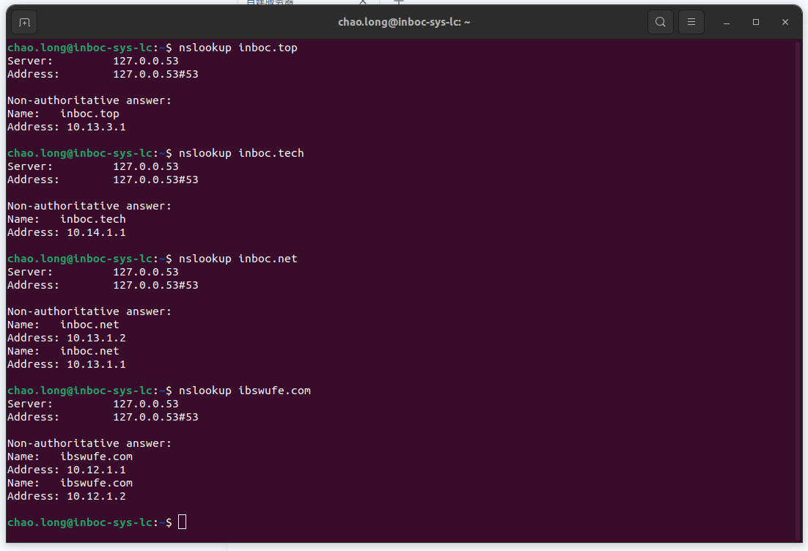

# 零、 现状
  windows server dns
	

------------------
# 一、DNS 主服务器
```
sudo apt install -y  bind9 bind9-utils
```
[references](https://cshihong.github.io/2018/10/15/DNS%E6%9C%8D%E5%8A%A1%E5%99%A8%E6%90%AD%E5%BB%BA%E4%B8%8E%E9%85%8D%E7%BD%AE/)
## 1.1 相关文件
`/etc/bind/named.conf`:  主配置文件，包含 bind 服务器的全局设置和引用其他配置文件的指令
`/etc/bind/named.conf.default-zones`:  定义了默认的区域（zone），如  localhost 、反向解析等
`/etc/bind/named.conf.local`:  用于配置本地区域（zone）和其他定制区域的文件
`/etc/bind/named.conf.options`:  包含bind服务器的全局选项设置，如监听地址、转发器等

## 1.2 配置
### 1.2.1  解析方式

   |方式|作用|
   |:--:|:--:|
   |正向|域名-->IP|
   |反向|IP-->域名|

### 1.2.2  DNS记录类型
- A 记录：将域名指向一个 ipv4
- AAAA 记录：将主机名解析到一个指定的 IPv6
- CNAME 记录：别名解析，指将不同的域名都转到一个域名记录上，由这个域名记录统一解析管理，即当前解析的域名是另一个域名的跳转
- NS 记录：域名服务记录，用来指定该域名由哪个 DNS 服务器来解析，一般设置为多个，一个为主，其余为辅，且只能写域名的形式
- PTR 记录：反向解析，主要用于 IP 解析为 FQDN
- MX 记录： 邮件交换记录
- TXT 记录： 指某个主机名或域名的说明，通常用来做SPF记录（反垃圾邮件）

### 1.2.3  目录结构
.
├── bind.keys
├── inboc
│   ├── db.zones
│   └── zones
├── named.conf
├── named.conf.default-zones
├── named.conf.local
├── named.conf.options
├── rndc.key
└── zones.rfc1918
### 1.2.4  配置文件
```
/etc/bind/named.conf                           # 可删除
	include "/etc/bind/inboc/zones"; 

/etc/bind/named.conf.options
	options {
        directory "/var/cache/bind";
        listen-on port 53 { localhost; };
        recursion yes;
        forward  first;
        forwarders {
                114.114.114.114;
                8.8.8.8;
        };
        allow-query { any;};
        auth-nxdomain no;
        dnssec-validation no;
        allow-update { none; };
    };

/etc/bind/inboc/zones
    zone "inboc.top"{
       type master;
       file "/etc/bind/inboc/db.zones";
       allow-transfer { 10.13.3.109; };
    };

/etc/bind/inboc/db.zones
	$TTL 10M
	@       IN      SOA     inboc.top. admin.inboc.top. (
	                                   1   ; serial
	                                1200   ; refresh 
	                                900    ; retry 
	                                900    ; expire
	                               1200 )  ; minimum 
	@        IN      NS      nameserver
	nameserver   IN  A       10.13.3.107
	nameserver  IN  A       10.13.3.109    
	test         IN  A       10.13.3.109
	k8s          IN  A       10.13.3.110
```
### 1.2.5  参数介绍
```
allow-update { none; };  定义允许执行动态 DNS 更新的客户端
allow-transfer { xx ; } 允许 xx 地址从您的 DNS 服务器复制数据
forward first; 优先选择转发到的 DNS 服务器
forwarders {}; 转发器，转发到另外的 DNS
recursion yes; 启用递归查询
dnssec-validation no; 禁用 BIND9 服务器上的 DNSSEC 验证，此时返回的数据或许有准确度的问题
auth-nxdomain no; 符合 RFC1035

1. Refresh（刷新）：Refresh 指定了 DNS 服务器应从主服务器获取区域数据的频率。最佳的 Refresh 时间取决于你的特定需求，通常在几小时到一天之间。较短的 Refresh 时间可以更快地更新数据，但会增加主服务器的负载。
2. Retry（重试）：Retry 指定了 DNS 服务器在未能联系到主服务器时应进行的重试间隔。最佳的 Retry 时间通常在几分钟到一小时之间，取决于网络的可靠性和延迟。较短的 Retry 时间可以更快地恢复到主服务器，但会增加 DNS 查询负载。
3. Expire（过期）：Expire 指定了区域数据在主服务器不可用时的最大存储时间。最佳的 Expire 时间通常在几天到一周之间。较短的 Expire 时间可以更快地更新过期的数据，但会增加 DNS 查询的负载。
4. Minimum TTL（最小生存时间）：Minimum TTL 指定了 DNS 解析器或缓存服务器应保留解析结果的最小时间。最佳的 Minimum TTL 时间取决于你的特定需求，通常在几分钟到一天之间。较短的 Minimum TTL 时间可以更快地更新解析结果，但会增加 DNS 查询的负载。
```

----------------
# 二、DNS 从服务器
## 2.1  安装和配置
```
/etc/bind/named.conf
	include "/etc/bind/inboc/slave.zones";

/etc/bind/named.conf.options
	# 同于 master 即可

/etc/bind/inboc/slave.zones;
	zone "inboc.top"{
       type slave;
       file "/etc/bind/inboc/db.slave.zones";
       masters { 10.13.3.107; }; 
	};
```
## 2.1 测试记录同步
- 修改主服务器，解析记录，测试从服务器的同步情况
```
$TTL 10M
@       IN      SOA     inboc.top. admin.inboc.top. (
                                   2   ; serial   #修改版本号
                                1200   ; refresh 
                                900    ; retry 
                                900    ; expire
                               1200 )  ; minimum 
@        IN      NS      nameserver
@        IN      NS      nameserver2              #较版本1新增
nameserver   IN  A       10.13.3.107
nameserver2  IN  A       10.13.3.109              #较版本1新增
test         IN  A       10.13.3.109
k8s          IN  A       10.13.3.110
me           IN  A       10.10.6.1               #较版本1新增
```

**热加载**新增的配置，每次修改记录时，需要同步修改***版本号***，slave 才能同步成功
```
sudo rndc reload     # 主服务器执行即可
dig -t a me.inboc.top @10.13.3.109
```

## 2.2 测试公网域名
- 此時公网域名成功解析得到的是保留ip地址，ping 域名不能成功----因为公司的 ip 做了加密
- 不能成功解析则无记录返回

-------------
# 三、 安全
## 3.1 功能同于bind-chroot
```
vi /etc/apparmor.d/usr.sbin.named
# 检查是否存在，否则增加以下内容
  /etc/bind/** r,
  /var/lib/bind/** rw,
  /var/lib/bind/ rw,
  /var/cache/bind/** lrw,
  /var/cache/bind/ rw,
  /var/log/named/** rw,
  /var/log/named/ rw,
```

以下不成功
## 3.2 开启DNSSEC验证，保证DNS服务器之间传输的安全性
```
dnssec-keygen -a RSASHA256 -b 1024 -n zone  inboc.top
 # -a: 算法   -b: 密钥长度   -n: zone 制定类型为域   +域名（inboc.top）
```
## 3.3 在主服务器中创建验证秘钥文件
```
/etc/bind/inboc/transfer.key
	key "inboc.top" {
	    algorithm rsasha256;    #配置识别失败
		secret "AwEAAdLreYwNMIqjP7bRdg8LJZmwdlmuC2kt/Wks4zfQBmAhf70zfVdR         U70fg0fYJprPVvzmXLJSJAjARc6m2a0u18DczwwVGcB8BcBdcxMRPjER b/p7Yjr96Sfd2s3AwpCvHFnQaF8oUyZijbtbkemCeViO2CsiLXMzPE3d 3jzVOiJF";
    };
```
## 3.4 在主服务器开启密钥验证
```
/etc/bind/named.conf
	include "/etc/bind/inboc/transfer.key";

/etc/bind/inboc/zones
	zone "inboc.top" {
	  allow-transfer { key inboc.top; };    #修改
	};
```
# 四、web 管理以及反向代理
[安装 webmin工具](https://www.mmcloud.com/2863.html)
[使用ngingx反代](https://devpress.csdn.net/cloud/6304db5f7e6682346619cf4b.html)
- 路径nginx/conf.d/webmin.conf
```
upstream webmin {
  server 10.13.3.107:10000;
}

server {
  server_name webmin.inboc.net;
  listen 443 ssl;
  ssl_certificate webmin/tls_ca.pem;
  ssl_certificate_key webmin/tls_key.pem;

  location / {
    proxy_pass      https://webmin;
    proxy_redirect  off;
    proxy_set_header   Host             $host:$server_port;
    proxy_set_header   X-Real-IP        $remote_addr;
    proxy_set_header   X-Forwarded-For  $proxy_add_x_forwarded_for;
    proxy_connect_timeout      10;
    proxy_send_timeout         10;
    proxy_read_timeout         10;
    proxy_buffer_size          128k;
    proxy_buffers              32 32k;
    proxy_busy_buffers_size    256k;
    proxy_temp_file_write_size 256k;
  }
}
```
# 五、bind9.18 over tls & nginx 反向代理
[反向代理参考](https://www.infvie.com/ops-notes/nginx-udp-dns.html)
[bind9 tls / https](https://dididudu998.github.io/2022/02/15/configure-doh-bind.html)网络层的问题是DoT使用853的端口，很容易被封锁，而DoH使用443端口，一般不会被封锁