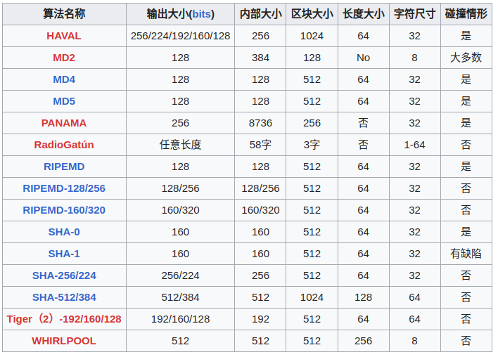

# 一、概念
[视频资料](https://www.bilibili.com/video/BV1S34y1s7CU/?share_source=copy_web&vd_source=f939ab8fee17097d0cb130b063f602db)
## 1.1 部分术语
- 哈希：给定任意长度的输入数据，通过特定的哈希算法，可以得到固定长度的输出（hash value）
	 - 作用
		 -  数据完整性验证
		 - 数据唯一性标识
		 - 密码存储和验证
		 - 数据加密和数字签名
		 - 散列表和查找算法
	 - 特性
		 - 单向性：根据哈希值不能得到输入数据 
		- 抗碰撞： （碰撞指 不同的输入在相同算法下得到相同的输出）
	- 常见哈希算法， 及其碰撞情形
	- 
- Diffie-Hellman Key Exchange： 作用--不安全信道下安全的交换秘钥，在后续的通讯中作为[对称密钥](https://zh.wikipedia.org/wiki/%E5%AF%B9%E7%A7%B0%E5%AF%86%E9%92%A5 "对称密钥")来[加密](https://zh.wikipedia.org/wiki/%E5%8A%A0%E5%AF%86 "加密")
- RSA 算法： 非对称加密算法（公钥+私钥）

# 二、数字签名

##  2.1 过程(信任作用，验证是正确的私钥拥有者，消息来源是可信任的)： 
消息发出 --> 哈希值计算 --> 哈希值 --> 私钥加密 --> 产生数字签名 --> 具有签名的消息内容发出 --> 公钥使用者 --> 公钥解密 --> 计算消息内容的哈希 + 数字签名的哈希值 --> 二者一致则是正确来源

##  2.2 RSA 签名的 openssl 演示
```
openssl genrsa -out private.pem 4096      # 生成密钥，指定文件名和长度
openssl rsa -in private.pem -pubout > public.pem     # 指定算法，基于私钥生成公钥，存储到指定文件
openssl dgst -sha1 -sign private.pem -out sha1.sign data.txt    # 对发出的信息 data.txt , 指定私钥做签名 -sign private.pem，指定算法进行哈系值的加密 -sha1, 输出为具有签名的文件 sha1.sign
ls
	private.pem    public.pem    sha1.sign    data.txt

openssl dgst -sha1 -verify public.pem -signature sha1.sign data.txt   # 指定算法通过公钥对具有签名的信息做验证
```

# 三、Message Authentication codes(MAC) 消息认证
- 防止消息被篡改，用于对称加密系统，通信双方共享一个秘钥
- 数字签名用于非对称加密

- MAC：对给定的数据 + 共享密钥，通过算法得到一个认证码
- 哈希：是对给定的数据做哈希计算得到哈希值

# 四、证书（特殊的签名）
## 4.1 作用
- 证明用户或设备受信任，持有的秘钥(公钥)是得到认证的，以此实现可信的信息传递
- 证书签发机构--certificate authority(CA)
- 证书
	- 证书颁发者的基本信息内容
	- 证书拥有者的基本信息 (eg: HTTPS 证书，包括有拥有者的域名，CNAME，组织名称，地点等)
	- 证书拥有者的公钥
	- 公钥和其他信息的签名

## 4.2 生成过程


角色：1.CA 机构 -- 2.服务提供者/证书申请者 --3.服务使用者

## 4.3 自签名的证书
	服务提供者自己作为CA（不经过正规CA），用自己的私钥，对自己的含公钥的申请做加密，然后将证书给予消费者

- openssl 自签名演示，生成根证书
```
openssl genrsa -des3 -out ca.key 2048   # 指定算法，生成指定的私钥，并对私钥加密 -des3(使用时需要此密码)
openssl  req -x509 -key ca.key -out ca.crt -days 365    # 生成根证书，内含公钥;（根证书，对ca机构自身的信息和摘要做加密生成签名，同时包含CA机构公钥）
      #         格式     指定私钥加密     指定输出    指定有效期
openssl x509  -in ca.crt  -text -noout    # 查看证书信息
 ```
 - 演示生成服务的证书
```
openssl genrsa -out mysite.com.key 2048   # 生成私钥
openssl req -new -key mysite.com.key -out mysite.csr    # 填写相关信息，利用私钥加密，生成签名(csr)文件

csr文件给CA机构，对该文件签名生成证书
openssl x509 -req -in ./mysite.com.csr  -CA  ./ca.crt  -CAkey ca.key  -set_serial 01 -out mysite.com.crt -days 365  # 指定服务的csr文件，CA机构的根证书、私钥，输出该服务的证书文件
```