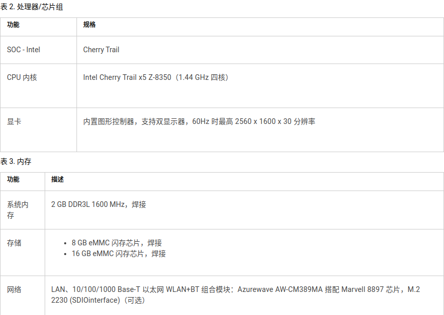
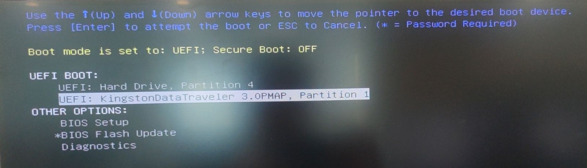
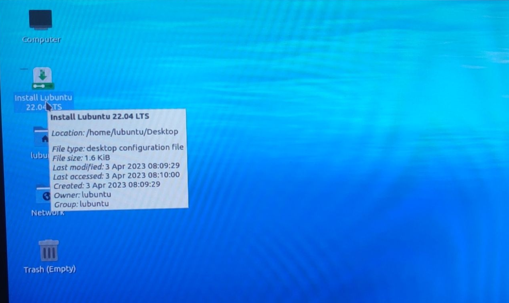
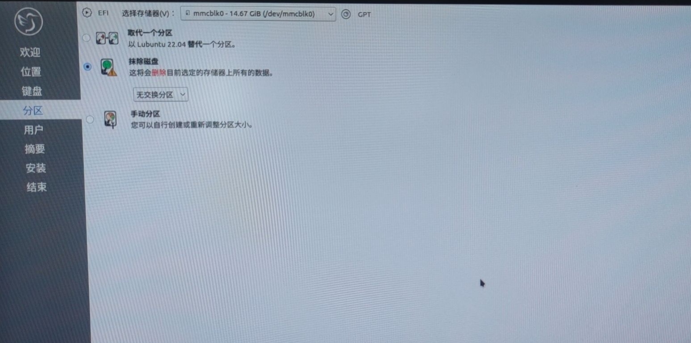
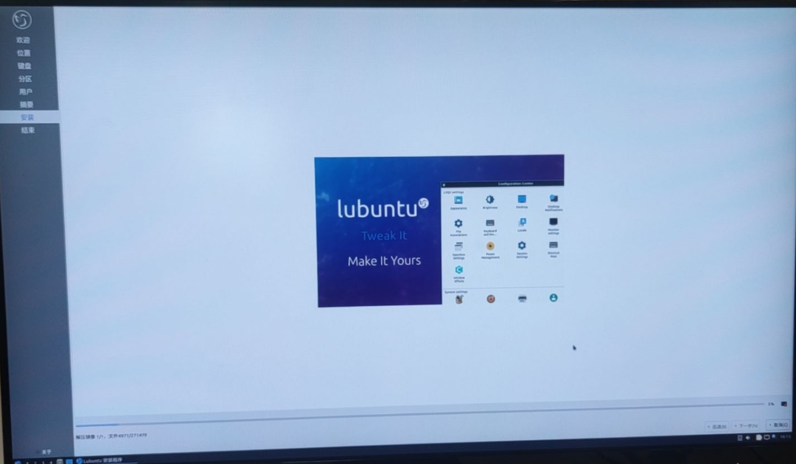
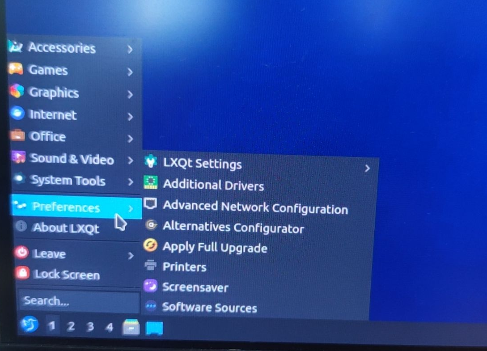
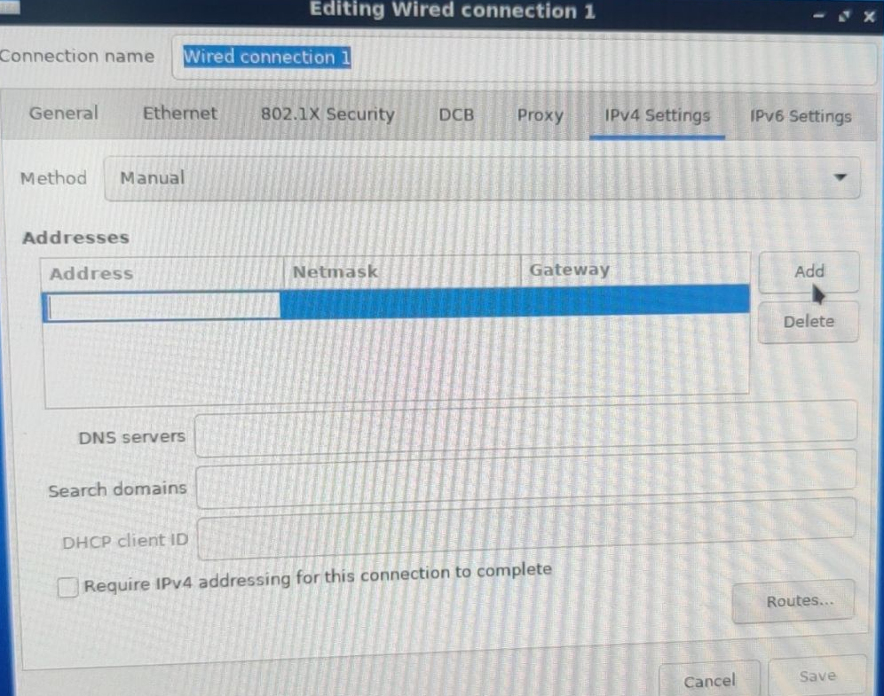

## 一、wyse3040简介
1. Dell Wyse 3040 瘦客户机是一种低成本的入门级瘦客户机平台。这些瘦客户机具有 x86 处理器，官方允许运行 Wyse ThinOS、启用 PCoIP 的 Wyse ThinOS 和 Wyse ThinLinux。
2. 硬件情况  

## 二、wyse3040改造
1. 最终选定安装Lubuntu操作系统到wyse3040，该项目的目标是提供一个基于坚如磐石的Ubuntu 基础的**轻量级但功能强大**的 Linux 发行版。Lubuntu 提供了一个简单但现代且功能强大的图形用户界面，并附带了各种各样的应用程序，可以使用浏览器访问监控页面。
2. 镜像下载，[Lubuntu镜像下载](https://lubuntu.me/downloads/)
3. 使用 UltraISO软碟通制作引导u盘，安装系统
4. 安装过程
    - F12进入BIOS，选择U盘引导,ENTER  
  
    {width=1000}
    - try and install ubuntu,ENTER  
  
    
    - 选择桌面安装程序，双击执行  
  
    
    - 依照引导选择即可，分区设置中：erase disk and install即可  
  
    
    - 等待安装完成，时长较长10+min  
  
    
    - 对有线网络做设置  
  
    
    
## 三、 试错与参考文件
1. 选择Lubuntu之前，对官方Thinos、Thinlinux测试，官方镜像制作引导盘，操作系统安装不成功。
2. 测试操作系统ubuntu22.04、windows10、windows enabled，无法进入安装页面，硬件不支持。
3. 参考连接  
    https://qubitsandbytes.co.uk/install-a-new-os-on-a-dell-wyse-3040/
    https://blog.roberthallam.org/2020/05/turning-a-wyse-3040-into-an-htpc-part-1/
    https://www.dell.com/support/home/zh-cn?app=drivers