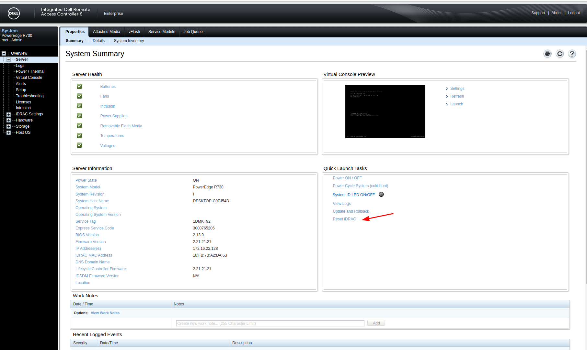

# Ubuntu install jdk7 to connect idarc8

[参考1](https://blog.csdn.net/stone_2323/article/details/77993739)
[参考2](https://www.cnblogs.com/mrwuzs/p/13200332.html)

1 . 背景： ubuntu 2204 安装jdk11 ，jdk8 连接idrac8不成功。jdk11出现network connection has been dropped。
           jdk8 出现access denied

2 . 尝试jdk7（该大版本的最新和最旧都尝试了，仍然出现access denied，最后reset idrac）(新一次的连接最好都做一次reset 并下载新的jnlp文件)

3 . 安装步骤
[jdk下载链接](https://download.oracle.com/otn/java/jdk/7/jdk-7-linux-x64.tar.gz)需要oracle帐号（且压缩包中需要具有bin/javaws）
```
    sudo tar zxvf jdk-7-linux-x64.tar.gz -C /usr/lib/jvm/
	sudo vim ~/.bashrc   # 末尾添加
		export JAVA_HOME=/usr/lib/jvm/jdk1.7.0    ## 这里要注意目录要换成自己解压的 jdk 目录
		export JRE_HOME=${JAVA_HOME}/jre
		export CLASSPATH=.:${JAVA_HOME}/lib:${JRE_HOME}/lib
		export PATH=${JAVA_HOME}/bin:$PATH
	source ~/.bashrc
	sudo update-alternatives --install /usr/bin/java java /usr/lib/jvm/jdk1.7.0_80/bin/java 300
    sudo update-alternatives --install /usr/bin/javac javac /usr/lib/jvm/jdk1.7.0_80/javac 300
    sudo update-alternatives --install /usr/bin/jar jar /usr/lib/jvm/jdk1.7.0_80/bin/jar 300
    sudo update-alternatives --install /usr/bin/javah javah /usr/lib/jvm/jdk1.7.0_80/bin/javah 300
    sudo update-alternatives --install /usr/bin/javap javap /usr/lib/jvm/jdk1.7.0_80/bin/javap 300
	sudo update-alternatives --config java
	java -version #确认安装情况和版本
	javaws viewer.jnlp
```

4 . reset idrac to solve access denied，better to redownload view.jnlp file , then start the jvm
	