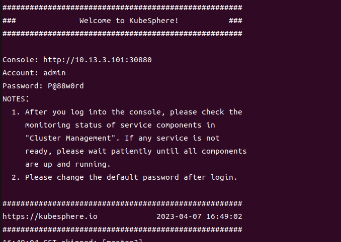

# Kubesphere

- 其中etcd部署于Master节点,启用内置高可用模块

|Hosts|IP|
|:---:|:---:|
|master1|10.13.3.101|
|master2|10.13.3.102|
|master3|10.13.3.103|
|woker1|10.13.3.104|
|woker2|10.13.3.105|
|woker3|10.13.3.106|

## 一、执行
1. 集群节点同步
```
- /etc/hosts  #集群中ip与主机名，主机别名的设置，规划主机在集群中的角色,(在hosts文件中定义或者定义一个变量文件)
- NTP  #时间同步服务
- setenforce=0
- swapoff -a #关闭交换分区，shell实现
- systemctl stop firewalld #关闭防火墙，firewalld模块
- install socat conntrack ebtables ipset #安装依赖
```
2. 下载kubekey，生成配置文件，并做必要修改（加参数指定版本，加参数不指定版本将默认安装最新版本的kubesphere和kubernetes）
```
curl -sfL https://get-kk.kubesphere.io | VERSION=v3.3.2 sh -
```

```
./kk create config --with-kubesphere [version] --with-kubernetes [version] -f ./config.yml 
```

```
spec:
  hosts:
  - {name: master1, address: 10.13.3.101, internalAddress: 10.13.3.101, user: root, password: "Inboc@2020"} 
  - {name: master2, address: 10.13.3.102, internalAddress: 10.13.3.102, user: root, password: "Inboc@2020"}
  - {name: master3, address: 10.13.3.103, internalAddress: 10.13.3.103, user: root, password: "Inboc@2020"}
  - {name: worker1, address: 10.13.3.104, internalAddress: 10.13.3.104, user: root, password: "Inboc@2020"}
  - {name: worker2, address: 10.13.3.105, internalAddress: 10.13.3.105, user: root, password: "Inboc@2020"}
  - {name: worker3, address: 10.13.3.106, internalAddress: 10.13.3.106, user: root, password: "Inboc@2020"}
  roleGroups:
    etcd:
    - master1
    - master2
    - master3
    control-plane:
    - master1
    - master2
    - master3
    worker:
    - worker1
    - worker2
    - worker3
  controlPlaneEndpoint:
    ## Internal loadbalancer for apiservers 
	internalLoadbalancer: haproxy     #使用内置HAproxy创建高可用模式
```
```
./kk create cluster -f config.yml
```

## 二、报错
#### 1. 超长时间停留在等待安装完成
   

---
##### 1.1 新开终端查看各节点状态，各pod状态，并describe输出相应pod信息
```
root@master1:~/kubesphere# kubectl get pods -A
NAMESPACE           NAME                                           READY   STATUS             RESTARTS   AGE
kube-system         calico-kube-controllers-69d878584c-fhnl8       1/1     Running            0          6m57s
......
kubesphere-system   ks-installer-85d6fb8c97-6crks                  0/1     ImagePullBackOff   0          6m54s

root@master1:~/kubesphere# kubectl describe pod ks-installer-85d6fb8c97-6crks
Error from server (NotFound): pods "ks-installer-85d6fb8c97-6crks" not found

```

##### 1.2 手动下载镜像
 docker search并docker pull到本地，标签和kubesphere版本一致即可。

#### 2.docker请求过多，下载次数达到上限

>>You have reached your pull rate limit. You may increase the limit by authenticat  ing and upgrading: https://www.docker.com/increase-rate-limit: Process exited with status 1
>>
    >>

---
##### 2.1 修改镜像源加速器为公司仓库、阿里云个人镜像源，仍发生相同报错
 ```
 {
  "log-opts": {
    "max-size": "5m",
    "max-file":"3"
  },
  "exec-opts": ["native.cgroupdriver=systemd"],
  "registry-mirrors": ["https://repo.inboc.net"]
}
```

##### 2.2修改加速器为腾讯或者网易的镜像源，可以成功,参考贴如下
```
vim /etc/docker/daemon.json
	{
	  "registry-mirrors": [
	    "https://hub-mirror.c.163.com"
	  ],
	  "live-restore": true
	}

systemctl daemon-reload && systemctl restart docker

```
>> [解决docker pull rate limit](https://www.chenshaowen.com/blog/how-to-cross-the-limit-of-dockerhub.html)

## 三、结果
1. 等待几分钟，初始化完成，以下命令可查看安装日志
```
kubectl logs -n kubesphere-system $(kubectl get pod -n kubesphere-system -l 'app in (ks-install, ks-installer)' -o jsonpath='{.items[0].metadata.name}') -f
```
2. 安装完成，可以访问dashboard，并修改登录密码
  

## 四、 自动化
1. 着手准备ansible文件，以后自定义各个节点并自动部署，gitlab
	 1.1 对集群初始化,包括这些方面
		 关闭防火墙、交换分区
	   
	 1.2 选定一个master主机执行kubekey的下载
	    拷贝过去配置文件，其中hosts部分需要做变量设定或者修改！！！
	    执行命令创建集群
	    对安装日志做查看
2. 部分书写规则
    2.1  细致分解下去并书写角色，之后再用角色写playbook
    2.2  在main.yml中使用include变量，以便引用角色时对不同的yml做引用。