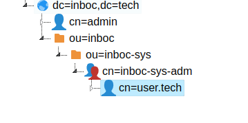
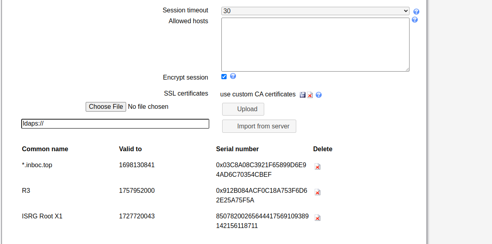
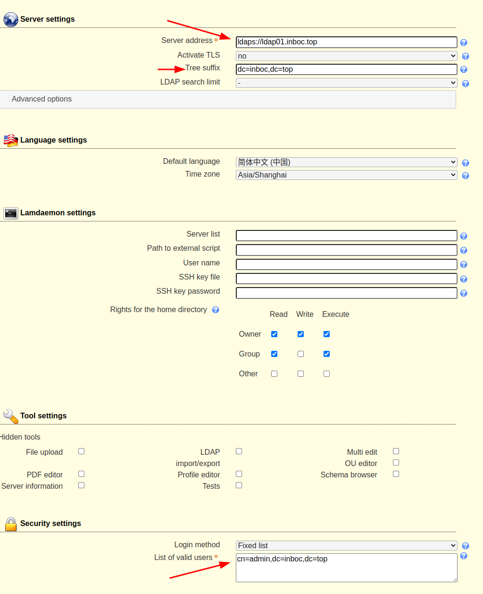
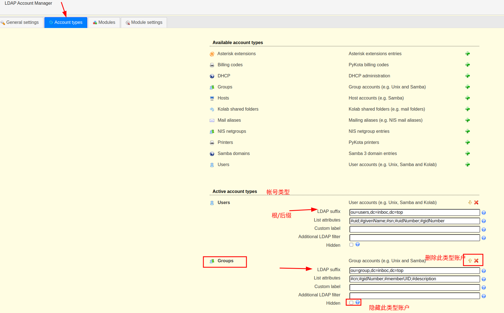
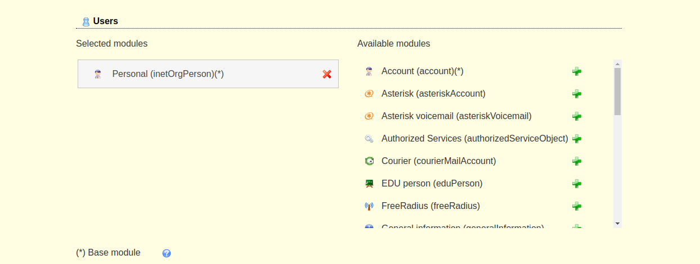
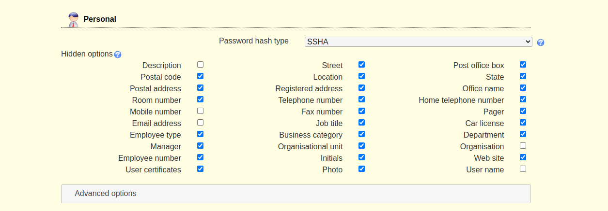
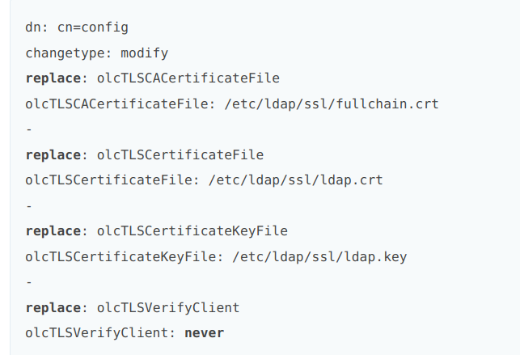
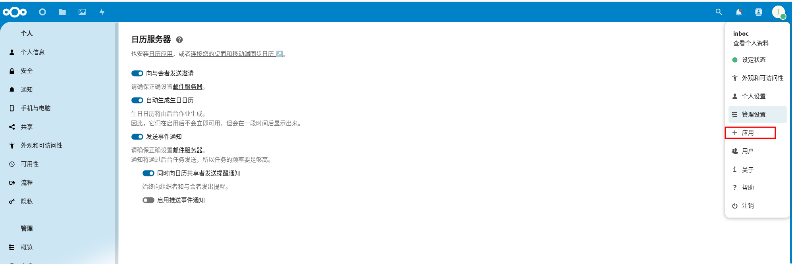
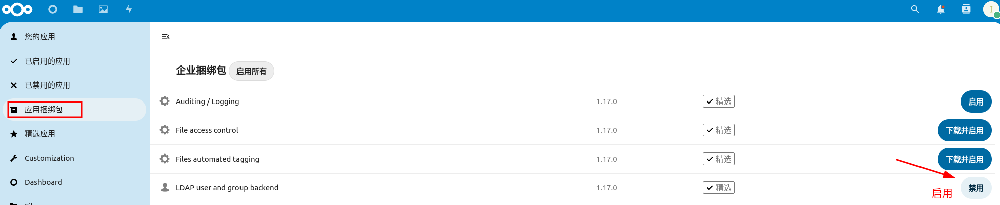
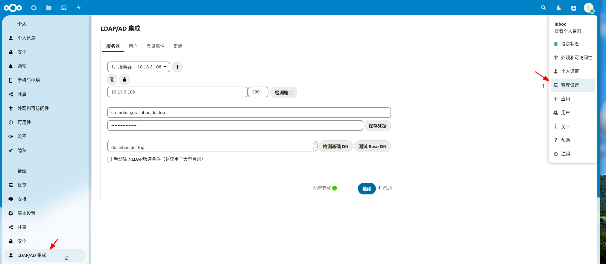

# 一、 概念
[官方手册](https://www.openldap.org/doc/admin26/guide.html)

## 1.1 常用属性
- DN：Distinguished Name，LDAP记录项的标识，有唯一性，例如：dc:"cn=admin,ou=developer,dc=163,dc=com"  
- dc= DomainComponent 为域组件，域名的一部分
- cn=CommonName 为记录名，表示一个实体，最长到80个字符，可以为中文；
- ou=OrganizationUnit 为组织单位，用于分类，最多四级，每级最长32字符，可以为中文；
- uid=User id 为用户的唯一标识
- c=Country 为国家名，可选，为2个字符长
- o=Organization 为组织名，可选，可以3—64个字符长

# 二、 安装和配置 LDAP

## 2.1 安装 slapd (独立的 LDAP 守护进程，同时便于管理服务)
```
sudo apt install  -y slapd ldap-utils
```
## 2.2  重新配置 OpenLDAP，创建 base dn
```
sudo dpkg-reconfigure slapd   # 主要配置密码 (密码在下一步重置，便于配置连接)，DNS domain name(即 LDAP 服务中的 base dn)

	 说明：
	第一步回答 No
	第二步填写域名，比如 mycompany.com
	第三步填写组织名，比如 Company
	第四步填写管理员密码，比如 secret；第五步确认管理员密码
	第六步选择使用的数据库后端，比如 MDB
	第七步选择在清除 slapd 时是否移除数据库，比如 Yes
	第八步选择是否移除旧数据库，比如 Yes
```


## 2.3 生成密码，用于控制台登录的admin帐号，需要保存此密文密码
```shell
slappasswd
	{SSHA}UiIUaWLBYOo+2O88GNxFAdzp5M9cmlWi
```
## 2.4 修改admin用户的ldif文件
```ldif
/etc/ldap/slapd.d/cn\=config/olcDatabase\=\{1\}mdb.ldif
	olcDatabase: {1}mdb
	olcSuffix: dc=example,dc=top
	olcRootDN: cn=admin,dc=example,dc=top
	olcRootPW: {SSHA}UiIUaWLBYOo+2O88GNxFAdzp5M9cmlWi
```
- olcDatabase: 定义使用的后端数据存储格式,遵循默认
- olcSuffix: 设置 LDAP 服务的根
- olcRootDN: 设置管理员用户的 dn
- olcRootPW: 管理员用户的密码，由上一步生成
- 修改后重启服务
```
sudo slaptest -u   # 检查配置文件
sudo systemctl enable slapd  --now

sudo slapcat        # 输出看到当前数据库内容
```

## 2.5 简单结构展示


## 2.6 创建base dn 

- 查看LDAP服务器的根目录信息
```
sudo ldapsearch -x -LLL -b '' -s base '(objectclass=*)'
	dn:
	objectClass: top
	objectClass: OpenLDAProotDSE
```

- 基于 ldif 文件直接创建，不使用图形化交互。创建之后，对这个 base dn 设置管理员的密码
```
-
dn: dc=example,dc=top
changetype: add
objectClass: top
objectClass: domain


-
dn: o=example,dc=example,dc=top
changetype: add
objectClass: organization
o: example
```

```
ldapmodify -x -D "cn=admin,dc=example,dc=top" -w example@2020  -f organization.ldif
```

## 2.7 创建多个 DIT + base dn
- 为新的库，准备存储路径
```
mkdir  /var/lib/ldap2
chown openldap:openldap  /var/lib/ldap2
vim /etc/apparmor.d/usr.sbin.slapd
		# the databases and logs
		/var/lib/ldap2/ r,
		/var/lib/ldap2/** rwk,
		
		# lock file
		/var/lib/ldap2/alock kw,

sudo systemctl  reload  apparmor 
```

- 准备 ldif 文件，创建新的 DIT（/etc/ldap/domian2.ldif）
```
dn: olcDatabase={2}mdb,cn=config
changetype: add
objectClass: olcDatabaseConfig
objectClass: olcMdbConfig
olcDbDirectory: /var/lib/ldap2/
olcDatabase: {2}Mdb
olcDbIndex: objectClass eq
olcDbIndex: cn,uid eq
olcDbIndex: uidNumber,gidNumber eq
olcDbIndex: member,memberUid eq
olcLastMod: TRUE
olcMonitoring: TRUE
olcDBNoSync: TRUE
olcAccess: {0}to attrs=userPassword by self write by anonymous auth by * non
 e
olcAccess: {1}to attrs=shadowLastChange by self write by * read
olcSuffix: dc=example,dc=tech
olcRootDN: cn=admin,dc=example,dc=tech
olcRootPW: {SSHA}UiIUaWLBYOo+2O88GNxFAdzp5M9cmlWi
```

```
sudo  ldapmodify -Y EXTERNAL -H ldapi:/// -f domian2.ldif
```

- 设置管理员
```
-
dn: cn=admin,dc=example,dc=tech
objectClass: simpleSecurityObject
objectClass: organizationalRole
cn: admin
userPassword: {SSHA}UiIUaWLBYOo+2O88GNxFAdzp5M9cmlWi
==========================
# 以下是playbook中模板文件
-
dn: cn=admin,{{ item.base_dn }}  
changetype: add  
objectClass: simpleSecurityObject  
objectClass: organizationalRole  
cn: admin  
userPassword: {SSHA}UiIUaWLBYOo+2O88GNxFAdzp5M9cmlWi
```

```
sudo ldapadd -x -D "cn=admin,dc=example,dc=tech" -w example@2020 -f basedn2.ldif
```

### 2.7.1 多 DIT 管理
- 查询服务器的域
```
ldapsearch -x -H ldap://10.13.3.107 -b "" -s base namingContexts
```

- 设置一个全权限的 acl ，跨域访问，相应的用户已经提前创建

```
让这个dn 用户: cn=user.tech,dc=example,dc=tech ;  可以阅读这个base dn : dc=example,dc=top 下的所有条目.
对应关系：数据库----{1}mdb  存储的base dn 是 dc=example,dc=top 。即，对谁的访问则将 acl 添加在谁的库下  

dn: olcDatabase={1}mdb,cn=config
changetype: modify
add: olcAccess
olcAccess: {2}to dn.subtree="dc=example,dc=top" by dn.base="cn=user.tech,dc=example,dc=tech" read
```

```
ldapmodify   -Y   EXTERNAL   -H   ldapi:///   -f  xxx
```
- 测试
```
root@example-sys-test-06:/etc/ldap/example# ldapsearch -x -b "dc=example,dc=top" -D "cn=user.tech,dc=example,dc=tech" -w example@2020
		# extended LDIF
		#
		# LDAPv3
		# base <dc=example,dc=top> with scope subtree
		# filter: (objectclass=*)
		# requesting: ALL
		#
		
		# example.top
		dn: dc=example,dc=top
		objectClass: top
		objectClass: domain
		dc: example
		
		# admin, example.top
		dn: cn=admin,dc=example,dc=top
		objectClass: simpleSecurityObject
		objectClass: organizationalRole
		cn: admin
		
		# search result
		search: 2
		result: 0 Success
		
		# numResponses: 3
		# numEntries: 2
root@example-sys-test-06:/etc/ldap/example# ldapsearch -x -b "dc=example,dc=tech" -D "cn=admin,dc=example,dc=top" -w example@2020
		# extended LDIF
		#
		# LDAPv3
		# base <dc=example,dc=tech> with scope subtree
		# filter: (objectclass=*)
		# requesting: ALL
		#
		
		# search result
		search: 2
		result: 32 No such object
		
		# numResponses: 1
```

- 测试的日志
```
Sep 15 14:18:54 example-sys-test-06 slapd[10052]: conn=1097 fd=12 ACCEPT from IP=127.0.0.1:59834 (IP=0.0.0.0:389)
Sep 15 14:18:54 example-sys-test-06 slapd[10052]: conn=1097 op=0 BIND dn="cn=user.tech,dc=example,dc=tech" method=128
Sep 15 14:18:54 example-sys-test-06 slapd[10052]: conn=1097 op=0 BIND dn="cn=user.tech,dc=example,dc=tech" mech=SIMPLE ssf=0
Sep 15 14:18:54 example-sys-test-06 slapd[10052]: conn=1097 op=0 RESULT tag=97 err=0 text=
Sep 15 14:18:54 example-sys-test-06 slapd[10052]: conn=1097 op=1 SRCH base="dc=example,dc=top" scope=2 deref=0 filter="(objectClass=*)"
Sep 15 14:18:54 example-sys-test-06 slapd[10052]: conn=1097 op=1 SEARCH RESULT tag=101 err=0 nentries=2 text=
Sep 15 14:18:54 example-sys-test-06 slapd[10052]: conn=1097 op=2 UNBIND
Sep 15 14:18:54 example-sys-test-06 slapd[10052]: conn=1097 fd=12 closed
=================
Sep 15 14:19:14 example-sys-test-06 slapd[10052]: conn=1098 fd=12 ACCEPT from IP=127.0.0.1:34916 (IP=0.0.0.0:389)
Sep 15 14:19:14 example-sys-test-06 slapd[10052]: conn=1098 op=0 BIND dn="cn=admin,dc=example,dc=top" method=128
Sep 15 14:19:14 example-sys-test-06 slapd[10052]: conn=1098 op=0 BIND dn="cn=admin,dc=example,dc=top" mech=SIMPLE ssf=0
Sep 15 14:19:14 example-sys-test-06 slapd[10052]: conn=1098 op=0 RESULT tag=97 err=0 text=
Sep 15 14:19:14 example-sys-test-06 slapd[10052]: conn=1098 op=1 SRCH base="dc=example,dc=tech" scope=2 deref=0 filter="(objectClass=*)"
Sep 15 14:19:14 example-sys-test-06 slapd[10052]: conn=1098 op=1 SEARCH RESULT tag=101 err=32 nentries=0 text=
Sep 15 14:19:14 example-sys-test-06 slapd[10052]: conn=1098 op=2 UNBIND
Sep 15 14:19:14 example-sys-test-06 slapd[10052]: conn=1098 fd=12 closed
```

# 三、 web管理器配置

## 3.1 安装  LAM (便于 CA 验证，连接 ldaps)
```
apt-get install ldap-account-manager
```
访问 http://ip/lam ，lam的所有配置都可以在web端配置，不需要去服务器上修改一行代码

### 3.1.1 LAM configuration

### 3.1.2  Profile Setting

- Edit general settings 来编辑通用配置，**默认密码 lam**，进入之后能配置证书


- Edit server profiles 来编辑服务器配置，最好先编辑服务器配置
- Security settings，管理登录用户，可以是固定的DN列表，也可以是LAM可以搜索LDAP以查找与给定用户名匹配的DN
- Note：
  未加密的LDAP连接或TLS加密连接使用ldap：//  ( 通过端口389连接)。
  LDAP+SSL（LDAPS）加密连接使用ldaps：//   (636)。TLS不能与ldaps：//组合使用。



- 显示的标签，二者均保留可以正常使用 tree view进行编辑


- 控制账户类显示的模块


- "Models setting" 页面配置 该记录需要的具体信息，勾选剔除


- tree view编辑更高效


### 3.1.3 反向代理 LAM web ui
```
upstream lam {
  server 10.13.3.108:8001;
}

server {
  listen 80;
  server_name lam.example.net;
  return 301 https://$server_name$request_uri;
}

server {
  server_name lam.example.net;
  listen 443 ssl;
  ssl_certificate webmin/tls_ca.pem;
  ssl_certificate_key webmin/tls_key.pem;

  location / {
     proxy_pass http://lam/;
     proxy_set_header Host $host;
     proxy_set_header X-Real-IP $remote_addr;
     proxy_set_header X-Forwarded-For $proxy_add_x_forwarded_for;
#     proxy_set_header X-Forwarded-Proto "https";
     proxy_read_timeout 1800s;
     proxy_http_version 1.1;
     proxy_set_header Upgrade $http_upgrade;
     proxy_set_header Connection "upgrade";
    }
  }
```

## 3.2 安装 phpldapadmin
```
Setting up php8.1 (8.1.2-1ubuntu2.14)                       # 版本信息，配置文件完整，存在证书认证并可以指定路径
Setting up php (2:8.1+92ubuntu1) 
Setting up phpldapadmin (1.2.6.3-0.2)                                       
```
### 3.2.1 安装
```
apt-get install phpldapadmin -y
nano /etc/phpldapadmin/config.php
	$servers->setValue('server','name','My LDAP Server');                      # 辨识，区分的作用
	$servers->setValue('server','host','69.87.216.102');                              #  修改ip为服务器 ip
	$servers->;setValue('server','base',array('dc=example,dc=com'));                    # 修改 array 内容为需求的根
	$servers->setValue('login','auth_type','session');                                              
	$servers->setValue('login','bind_id','cn=admin,dc=example,dc=com');           #   绑定登录帐号admin，相应修改 dn 号即可
	$servers->setValue('auto_number','min',array('uidNumber'=>10000,'gidNumber'=>10000));   # 规定 uid，gid 数字表示的起始范围
```
### 3.2.2 为 phpLDAPadmin 配置 Apache
```
a2dissite 000-default.conf        # 禁用默认的 Apache 虚拟主机配置文件
systemctl restart apache2          
```

# 四、 主从架构(弃用，此配置需要在从服务器拉取 refresh)
[模式介绍](https://darkdark.top/ch5-replication.html)
## 4.1 master 加载同步模块
```
cat /etc/ldap/mod_syncprov.ldif
		dn: cn=module,cn=config
		objectClass: olcModuleList
		cn: module
		olcModulePath: /usr/lib/ldap
		olcModuleLoad: syncprov.la          # 此配置和上一句配置，实际是在请求这个路径的文件，/usr/lib/ldap/syncprov.la，不确定的可以用 find 查找

ldapadd -Y EXTERNAL -H ldapi:/// -f ./mod_syncprov.ldif
```
## 4.2 同步设置
```
root@example-sys-test-06:/etc/ldap# cat syncprov.ldif 
		dn: olcOverlay=syncprov,olcDatabase={1}mdb,cn=config       # 此处需要确认自己的数据库是什么样的，{2}hdb--旧版本默认 / {1}mdb--新版本默认
		objectClass: olcOverlayConfig
		objectClass: olcSyncProvConfig
		olcOverlay: syncprov
		olcSpCheckpoint: 100 10
		olcSpSessionLog: 100

ldapadd -Y EXTERNAL -H ldapi:/// -f ./syncprov.ldif                             # 修改并应用条目到 LDAP 服务  -Y EXTERNAL    将使用服务器配置的外部身份验证方法进行身份验证，而不是使用用户名和密码; -H 指定服务器连接; -f 指定文件
```
## 4.3 从服务器配置
```
root@example-sys-test-07:/etc/ldap# cat syncrepl.ldif
		dn: olcDatabase={1}mdb,cn=config
		changetype: modify
		add: olcSyncRepl
		olcSyncRepl: rid=002
		  provider=ldap://10.13.3.106:389/        # 此处开始与上一行有缩进
		  bindmethod=simple
		  binddn="cn=admin,dc=example,dc=top"
		  credentials=example@2020      
		  searchbase="dc=example,dc=top"
		  scope=sub
		  schemachecking=on
		  type=refreshAndPersist
		  retry="5 5 300 +"
		  attrs="*,+"
		  interval=00:00:00:3

ldapadd -Y EXTERNAL -H ldapi:/// -f /etc/ldap/syncrepl.ldif
```
- 运行中，修改主服务器内数据后，对从服务器u做刷新，可以看到是否同步

参数说明：
- provider 为ldap master/slave的地址 ;
- binddn：为域的基本信息，注这里一定要用管理员进行登录，否则同步不到用户的密码。
- credentials: ldap管理员的密码
- searchbase：选择要同步的独立域，根节点
- scope：设置所有的条目匹配
- schemachecking：设置同步更新时间检测
- type：同步模式为refreshAndPersist， refreshOnly 模式下后续操作由客户端轮询完成
- retry:同步更新重试次数和时间刚开始的5秒重试5次，以后每300秒重试一次
- attrs:复制全部属性
- interval 这里设置更新时间，这里为3秒一次，倒数第二个是分钟 以此类推。


# 四、 镜像复制
[模式介绍](https://darkdark.top/ch5-replication.html)
## 4.1 ldap.example.top下编辑 mirrorsync.ldif
```
dn: cn=module,cn=config         # 此段配置加载s ync 模块
objectClass: olcModuleList
cn: module
olcModulePath: /usr/lib/ldap
olcModuleLoad: syncprov.la     # 此配置和上一句，实际是在请求这个路径的文件，/usr/lib/ldap/syncprov.la，不确定的可 find 查找

-
dn: olcOverlay=syncprov,olcDatabase={1}mdb,cn=config        
	 # 此处需确认自己的数据库，{2}hdb--为旧版本默认 / {1}mdb--为新版本默认。路径 /etc/ldap/slapd.d/cn\=config/olcDatabase\=\{1\}mdb.ldif
objectClass: olcOverlayConfig
objectClass: olcSyncProvConfig
olcOverlay: syncprov
olcSpSessionLog: 100

-
dn: cn=config
changetype: modify
replace: olcServerID
olcServerID: 0                                        # 标识本机的 server id

dn: olcDatabase={1}mdb,cn=config      # 以下配置用于开启复制，指定主服务器
changetype: modify
add: olcSyncRepl
olcSyncRepl: rid=000                             # 标识唯一的 replica id
  provider=ldaps://ldap01.example.top       # 看上述记录介绍参数
  bindmethod=simple
  binddn="cn=admin,dc=example,dc=top"
  credentials=example@2020
  searchbase="dc=example,dc=top"
  tls_reqcert=allow
  scope=sub
  schemachecking=on
  type=refreshAndPersist
  retry="30 5 300 3"
  interval=00:00:05:00
-
add: olcMirrorMode                        # 开启 mirror mode
olcMirrorMode: TRUE

```

## 4.2 ldap01.example.top下编辑 mirrorsync.ldif
```
dn: cn=module,cn=config
objectClass: olcModuleList
cn: module
olcModulePath: /usr/lib/ldap
olcModuleLoad: syncprov.la

-
dn: olcOverlay=syncprov,olcDatabase={1}mdb,cn=config
objectClass: olcOverlayConfig
objectClass: olcSyncProvConfig
olcOverlay: syncprov
olcSpSessionLog: 100

-
dn: cn=config
changetype: modify
replace: olcServerID
olcServerID: 1

dn: olcDatabase={1}mdb,cn=config
changetype: modify
add: olcSyncRepl
olcSyncRepl: rid=001
  provider=ldaps://ldap.example.top
  bindmethod=simple
  binddn="cn=admin,dc=example,dc=top"
  credentials=example@2020
  searchbase="dc=example,dc=top"
  tls_reqcert=allow
  scope=sub
  schemachecking=on
  type=refreshAndPersist
  retry="30 5 300 3"
  interval=00:00:05:00
-
add: olcMirrorMode
olcMirrorMode: TRUE

```
## 4.3 加载配置
```
ldapadd -Y EXTERNAL -H ldapi:/// -f mirrorsync.ldif
```

# 五、 TLS加密（自签名+权威证书）
（自签名证书加密连接 nextcloud 失败，考虑采用 权威证书或stunnel）

## 5.1 CA中心创建证书
	此时使用LDAP 主服务器 作为 CA 中心，自签名
- 安装 gnutls-bin 和 ssl-cert 包
```
sudo apt install gnutls-bin ssl-cert
```
- 为证书授权中心创建私钥
```
sudo certtool --generate-privkey --bits 4096 --outfile /etc/ssl/private/mycakey.pem
```
- 创建模板文件来定义CA
```
/etc/ssl/ca.info
	 cn = example (example company)  
	 ca
	 cert_signing_key
	 expiration_days = 3650
```
- 创建自签名 CA (根)证书
```
sudo certtool --generate-self-signed \
--load-privkey /etc/ssl/private/mycakey.pem \
--template /etc/ssl/ca.info \
--outfile /usr/local/share/ca-certificates/mycacert.crt
```
- Note：
	`--outfile`路径是正确的，将CA证书写入`/usr/local/share/ca-certificates`。
	**update-ca-certificates** 将从这里获取受信任的本地CA。如果要从`/usr/share/ca-certificates`获取CA，需要调用`dpkg-reconfigure ca-certificates`

- 将新的 CA 根证书添加到受信任 CA 列表
```
sudo update-ca-certificates     # 会创建一个/etc/ssl/certs/mycacert.pem符号链接，指向/usr/local/share/ca-certificates中的真实文件
```
## 5.2 创建 LDAP 服务的服务器私钥与证书
- 创建私钥
```
sudo certtool --generate-privkey \
--bits 2048 \
--outfile /etc/ldap/ldap01_slapd_key.pem
```
- 服务器信息文件
```
/etc/ssl/ldap01.info
	organization = example
	cn = ldap01.example.top                     # 服务器证书的DN必须使用CN属性来命名服务器，并且CN必须携带服务器的完全限定域名，dns 需要有 A 记录解析
	tls_www_server
	encryption_key
	signing_key
	expiration_days = 365
证书有效期为1年，仅对_`ldap01`_主机名有效
```
- 创建LDAP服务器的证书
```
sudo certtool --generate-certificate \
--load-privkey /etc/ldap/ldap01_slapd_key.pem \
--load-ca-certificate /etc/ssl/certs/mycacert.pem \
--load-ca-privkey /etc/ssl/private/mycakey.pem \
--template /etc/ssl/ldap01.info \
--outfile /etc/ldap/ldap01_slapd_cert.pem
```
- 调整权限
```
sudo chgrp openldap /etc/ldap/ldap01_slapd_key.pem
sudo chmod 0640 /etc/ldap/ldap01_slapd_key.pem
```
- ca根证书加入到受信列表
```
sudo cp   cacertificatefile  /usr/local/share/ca-certificates/mycacert.crt
sudo update-ca-certificates
```
  
- 对LDAP服务配置证书
```
dn: cn=config
add: olcTLSCACertificateFile
olcTLSCACertificateFile: /etc/ssl/certs/mycacert.pem
-
add: olcTLSCertificateFile
olcTLSCertificateFile: /etc/ldap/ldap01_slapd_cert.pem
-
add: olcTLSCertificateKeyFile
olcTLSCertificateKeyFile: /etc/ldap/ldap01_slapd_key.pem
```
- 配置slapd-config数据库：
```
sudo ldapmodify -Y EXTERNAL -H ldapi:/// -f certinfo.ldif 
```
- 报错调整，更改`certinfo.ldif`，将`add`改成了`replace`，可以解决以下问题。修改后再次执行`ldapmodify`
```
ldapmodify -Y EXTERNAL -H ldapi:/// -f certinfo.ldif 
	SASL/EXTERNAL authentication started SASL username: gidNumber=0+uidNumber=0,cn=peercred,cn=external,cn=auth 
	SASL SSF: 0 
	modifying entry "cn=config" ldap_modify: Inappropriate matching (18) 
	additional info: modify/add: olcTLSCACertificateFile: no equality matching rule
```
- 增添配置文件
```
/etc/ldap/ldap.conf
	# LDAP Defaults
	# See ldap.conf(5) for details
	# This file should be world readable but not world writable.	
	BASE       dc=example,dc=top                                                      # LDAP服务的基础DN
	URI ldap://localhost:389 ldaps://localhost:636                        # 指定LDAP服务器的连接地址，似乎不起作用
	#SIZELIMIT  12                                                                      # 搜索结果的数量限制
	#TIMELIMIT  15                                                                     # 最长搜索时间
	#DEREF              never                                                            # 指定对别名的处理方式
	# TLS certificates (needed for GnuTLS)
	TLS_CACERT  /etc/ssl/certs/ca-certificates.crt                      # TLS连接时使用的CA证书文件的路径
	TLS_REQCERT demand                                                        # "demand"，表示需要验证服务器的证书
```
- 需要访问 LDAPS（LDAP over SSL），需要编辑配置，并重启 slapd
```
/etc/default/slapd
	SLAPD_SERVICES="ldap:/// ldapi:/// ldaps:///"
```
- 测试启动 TLS
```
ldapwhoami -x -ZZ -H ldap://ldap01.example.com
anonymous
```
- 测试连接
```
ldapwhoami -x -H ldaps://ldap01.example.com
anonymous
```

## 5.3 LDAP 从服务器的 TLS, 在主服务器创建后，拷贝证书到从服务器
-  指定目录保存
```
mkdir ldap02-ssl
cd ldap02-ssl
certtool --generate-privkey \
--bits 2048 \
--outfile ldap02_slapd_key.pem
```
- 编辑信息文件ldap02.info
```
organization = example
cn = ldap02.example.top                      
tls_www_server
encryption_key
signing_key
expiration_days = 365
```
- 创建证书
```
sudo certtool --generate-certificate \
--load-privkey ldap02_slapd_key.pem \
--load-ca-certificate /etc/ssl/certs/mycacert.pem \
--load-ca-privkey /etc/ssl/private/mycakey.pem \
--template ldap02.info \
--outfile ldap02_slapd_cert.pem
```

```
cp /etc/ssl/certs/mycacert.pem .
scp -r ldap02-ssl user@ldap02_ip:
```
- 从服务器中安装证书
```
sudo cp ldap02_slapd_cert.pem ldap02_slapd_key.pem /etc/ldap
sudo chgrp openldap /etc/ldap/ldap02_slapd_key.pem
sudo chmod 0640 /etc/ldap/ldap02_slapd_key.pem
sudo cp mycacert.pem /usr/local/share/ca-certificates/mycacert.crt
sudo update-ca-certificates
```
- 对LDAP服务配置证书 `./certinfo.ldif `
```
dn: cn=config
add: olcTLSCACertificateFile
olcTLSCACertificateFile: /etc/ssl/certs/mycacert.pem
-
add: olcTLSCertificateFile
olcTLSCertificateFile: /etc/ldap/ldap02_slapd_cert.pem
-
add: olcTLSCertificateKeyFile
olcTLSCertificateKeyFile: /etc/ldap/ldap02_slapd_key.pem
```
- 配置slapd-config数据库：
```
sudo ldapmodify -Y EXTERNAL -H ldapi:/// -f certinfo.ldif 
```
- 增添配置文件
```
/etc/ldap/ldap.conf
	BASE       dc=example,dc=top                                                      # LDAP服务的基础DN
	URI ldap://localhost:389 ldaps://localhost:636                        # 指定LDAP服务器的连接地址，似乎不起作用
	#SIZELIMIT  12                                                                      # 搜索结果的数量限制
	#TIMELIMIT  15                                                                     # 最长搜索时间
	#DEREF              never                                                            # 指定对别名的处理方式
	# TLS certificates (needed for GnuTLS)
	TLS_CACERT  /etc/ssl/certs/ca-certificates.crt                      # TLS连接时使用的CA证书文件的路径
	TLS_REQCERT demand                                                        # "demand"，表示需要验证服务器的证书
```
- 需要访问 LDAPS（LDAP over SSL），需要编辑配置，并重启 slapd
```
/etc/default/slapd
	SLAPD_SERVICES="ldap:/// ldapi:/// ldaps:///"
```
- 测试启动 TLS
```
ldapwhoami -x -ZZ -H ldap://ldap02.example.top
anonymous
```
- 测试连接
```
ldapwhoami -x -H ldaps://ldap02.example.top
anonymous
```

## 5.4 使用合法证书

- 将新的 CA 根证书添加到受信任 CA 列表（客户端需要）
```
sudo   cp   _.example.top-chain.pem   /usr/local/share/ca-certificates/mycacert.crt
sudo update-ca-certificates
```

- 准备服务器证书和私钥（服务端）
```
 ls /etc/ldap
	certinfo.ldif   _.example.top-crt.pem   _.example.top-key.pem
sudo chgrp openldap /etc/ldap/_.example.top-key.pem
sudo chmod 0640 /etc/ldap/_.example.top-key.pem
```

- certinfo.ldif
```
dn: cn=config
changetype: modify
replace: olcTLSCACertificateFile
olcTLSCACertificateFile: /etc/ssl/certs/mycacert.pem
-
replace: olcTLSCertificateFile
olcTLSCertificateFile: /etc/ldap/_.example.top-crt.pem
-
replace: olcTLSCertificateKeyFile
olcTLSCertificateKeyFile: /etc/ldap/_.example.top-key.pem

```

```
sudo ldapadd  -Y   EXTERNAL  -H  ldapi:///   -f    certinfo.ldif
```



- 增添配置文件，这是作为客户端连接 ldap 服务器使用的配置
```
/etc/ldap/ldap.conf
	BASE       dc=example,dc=top                                                      # LDAP服务的基础DN
	#URI ldap://localhost:389 ldaps://localhost:636                        # 指定LDAP服务器的连接地址，似乎不起作用
	#SIZELIMIT  12                                                                      # 搜索结果的数量限制
	#TIMELIMIT  15                                                                     # 最长搜索时间
	#DEREF              never                                                            # 指定对别名的处理方式
	# TLS certificates (needed for GnuTLS)
	TLS_CACERT  /etc/ssl/certs/ca-certificates.crt                      # TLS连接时使用的CA证书文件的路径，必需
	TLS_REQCERT demand                                                        # "demand"，表示需要验证服务器的证书
```
- 启用 ldaps，重启 slapd
```
/etc/default/slapd
	SLAPD_SERVICES="ldap:/// ldapi:/// ldaps:///"
```


## 5.5 使用 nextcloud 测试加密连接

- docker 安装 nexcloud，登录 UI ，点击账户，选择应用


- 开启 LDAP 集成

- 设置连接


- ldaps连接(严格一致才是tls加密，nextcloud应该只信任权威证书)


- 明文传输 

## 5.6 stunnel 加密连接应用(例：phpldapadmin)

链路： ldap user ui  ---- stunnel client  accept  ----  stunnel client connect  ---- stunnel server accept  ---- stunnel server connect ----ldap server port
```
apt install -y stunnel4
vim /etc/default/stunnel4
	ENABLED=1
```

```
# stunnel 服务端
	cert = /etc/stunnel/stunnel.pem
	key = /etc/stunnel/stunnel-key.pem
	verify = 3
	client = no
	debug = 6
	pid = /var/run/stunnel4/stunnel4.pid
	
	[ldap]
	accept = 10.13.3.106:6360                # 监听 stunnel 服务的流量，客户端（是指stunnel 客户端）将连接此目标并发送流量到这里
	connect = 10.13.3.106:389                # 转发到 stunnel 加密连接的服务的端口
	CAfile = /etc/stunnel/stunnel.pem

# stunnel 客户端
	cert = /etc/stunnel/stunnel.pem
	key = /etc/stunnel/stunnel-key.pem
	verify = 3
	client = yes
	debug = 6
	setuid = stunnel4
	setgid = stunnel4
	pid = /var/run/stunnel4/stunnel4.pid
	
	[ldap]
	accept = 10.13.3.107:389                # 监听 stunnel 服务的流量，客户端（是指ldap的客户端）将连接此目标并发送流量到这里
	connect = 10.13.3.106:6360              # 加密连接并转发到 stunnel 的服务端
	CAfile = /etc/stunnel/stunnel.pem
```

```
/etc/phpldapadmin/config.php
	$servers->setValue('server','host','69.87.216.102');  # 指向 stunnel 客户端，和他本地监听的端口
	$servers->setValue('server','port',389);	
```
# 六、 其他模块
## 6.1 日志模块
```
/etc/ldap/loglevel.ldif
	dn: cn=config
	changetype: modify
	replace: olcLogLevel
	olcLogLevel: stats

ldapmodify  -Y  EXTERNAL  -H  ldapi:///  -f  loglevel.ldif               # 日志在/var/log/syslog | grep slapd , 比默认的级别详细
```
## 6.2 member of
```
/etc/ldap/refint.ldif
	# enable_refint.ldif
	dn: cn=module{0},cn=config
	changetype: modify
	add: olcModuleLoad
	olcModuleLoad: refint.la
	-
	dn: olcOverlay=refint,olcDatabase={1}mdb,cn=config
	changetype: add
	objectClass: olcOverlayConfig
	objectClass: olcRefintConfig
	olcOverlay: refint

ldapadd -Q -Y EXTERNAL -H ldapi:// -f refint.ldif
```

```
/etc/ldap/memberof.ldif
	dn: cn=module,cn=config
	changetype: add
	cn: module
	objectClass: olcModuleList
	olcModulePath: /usr/lib/ldap
	
	dn: cn=module{0},cn=config
	changetype: modify
	add: olcModuleLoad
	olcModuleLoad: memberof.la
	
	dn: olcOverlay=memberof,olcDatabase={1}mdb,cn=config
	changetype: add
	objectClass: olcConfig
	objectClass: olcMemberOf
	objectClass: olcOverlayConfig
	objectClass: top
	olcOverlay: memberof
	olcMemberOfDangling: ignore
	olcMemberOfRefInt: TRUE
	olcMemberOfGroupOC: groupOfNames
	olcMemberOfMemberAD: member
	olcMemberOfMemberOfAD: memberOf

ldapmodify -Y EXTERNAL -H ldapi:/// -f memberof.ldif
```

## 6.3 Self Service Password 自助密码管理（需要反代设置+链接不能正常进入）
- 跨域权限设置修改密码的权限
```
下列权限可以使得 "admin,example,net" 对这个域 "dc=example,dc=tech" 做用户添加、属性修改
olcAccess: {0}to attrs=userPassword,shadowLastChange by dn="cn=admin,dc=example,dc=net" write by anonymous auth by self write by * none
olcAccess: {1}to dn.subtree="dc=example,dc=tech" by dn.base="cn=admin,dc=example,dc=net" write
```

- ssp.conf.php  成功版本
```
<?php
$debug = false;
$keyphrase = "example";
$use_sms = false;
$use_questions = false;
$lang = "cn,zh-CN";
$use_change = true;

# LDAP

$ldap_url = "ldaps://ldap01.example.net/";
$ldap_starttls = false;
$ldap_binddn = "cn=admin,dc=example,dc=net";
$ldap_bindpw = 'example@2020';
$ldap_base = "dc=example,dc=net";
$ldap_base = "dc=example,dc=tech";

$ldap_login_attribute = "uid";
$ldap_fullname_attribute = "cn";
$ldap_filter = "(&(objectClass=person)($ldap_login_attribute={login}))";
$ldap_use_exop_passwd = false;
$ldap_use_ppolicy_control = false;
$TLS_REQCERT = "allow";

# email
$mail_attributes = array( "mail", "gosaMailAlternateAddress", "proxyAddresses" );
$mail_address_use_ldap = true;
$mail_from = "x.z@example.net";
$mail_from_name = "密码自主修改服务";
$mail_signature = "英博智云";
$notify_on_change = false;
$mail_protocol = 'smtp';
$mail_smtp_host = 'smtphz.qiye.163.com';
$mail_smtp_auth = true;
$mail_smtp_user = "x.z@example.net";
$mail_smtp_pass = 'uKLMbr2mUp3CDEXC';
$mail_smtp_port = 465;
$mail_smtp_timeout = 30;
$mail_smtp_keepalive = false;
$mail_smtp_secure = 'ssl';
$mail_smtp_autotls = false;
$mail_smtp_options = array();
$mail_contenttype = 'text/plain';
$mail_wordwrap = 0;
$mail_charset = 'utf-8';
$mail_priority = 3;

# password policy
$pwd_min_length = 6;
$pwd_max_length = 14;
$pwd_min_lower = 1;
$pwd_min_upper = 1;
$pwd_min_digit = 1;
$pwd_min_special = 1;
$pwd_special_chars = "^a-zA-Z0-9";
$pwd_complexity = 4;
$pwd_no_reuse = true;
$pwd_forbidden_words = array("example", "example", "example", "password");
$pwd_show_policy_pos = "above";
$pwd_show_policy = "onerror";

?>
```

```
docker run -p 8000:80 \
> --restart=always \
> --name sspass \
> -v /home/example/sspasswd/conf.php:/var/www/conf/config.inc.local.php \
> -itd docker.io/ltbproject/self-service-password
```

### 6.3.1 不能进入修改链接 Token is not valid
```
注释了这两项
#$use_tokens = true;
#$crypt_tokens = true;
```

### 6.3.2 反向代理
```
upstream ssp {
  server 10.13.3.108:8000;
}

server {
    listen 80;
    server_name ssp.example.net;
    return 301 https://$server_name$request_uri;
}
server {
    listen 443 ssl ;
    server_name ssp.example.net;
    ssl_certificate webmin/tls_ca.pem;
    ssl_certificate_key webmin/tls_key.pem;

    location / {
      proxy_pass http://ssp;
      proxy_set_header Host $host;
      proxy_set_header X-Real-IP $remote_addr;
      proxy_set_header X-Forwarded-For $proxy_add_x_forwarded_for;
      proxy_set_header X-Forwarded-Proto "https";
      proxy_read_timeout 1800s;
      proxy_http_version 1.1;
      proxy_set_header Upgrade $http_upgrade;
      proxy_set_header Connection "upgrade";
    }
}
```


## 6.4 LDAP 对目录信息的数据做备份还原和迁移
### 6.4.1 备份

```
sudo slapcat -n 3 -l ./back3.ldif           # -n 指定数据库编号，数字对应各个dit的数据库编号( 配置数据库----olcDatabase={0}config.ldif; 目录信息数据库----olcDatabase={1}mdb.ldif )
```

### 6.4.2 恢复
原服务器上恢复，服务需要暂停
```
sudo systemctl stop slapd
```

配置目录一般位于 `/etc/openldap/slapd.d`，将原有配置删除，然后使用 `slapadd` 导入新的配置
```
$ rm -rf /etc/ldap/slapd.d/*
$ slapadd  -n  0  -F  /etc/ldap/slapd.d  -l  ./config.2021-09-18.ldif
$ chown -R openldap:openldap /etc/ldap/slapd.d
```

数据目录一般位于 `/var/lib/ldap-*`，模拟时，将原有数据删除，然后使用 `slapadd` 导入新的数据：
```
$ rm  -rf  /var/lib/ldap-example/*         # 定制了不同的dit有不同的目录分别存储不同domain的内容，注意，导入前目录必需首先存在，且权属 openldap:openldap。
$ slapadd -n 1 -F /etc/openldap/slapd.d -l ./data.2021-09-18.ldif
$ chown -R openldap:openldap  /var/lib/ldap-example
$ systemctl start slapd
```
### 6.4.3 openldap的迁移
playbook 新建的服务器，执行恢复
```
slapadd -n 1 -F /etc/openldap/slapd.d -l ./data.2021-09-18.ldif

#如果导入失败，或者数据已存在，删除rm -rf /var/lib/ldap/*  重新导入
```


# 七、 命令资料
> [以下来自此处](https://blog.csdn.net/jenyzhang/article/details/56487627)
>ldap  
    |-slapd             目录服务的主要程序  
    |-slurpd           目录服务进行复制的程序  
    |-slapadd           向目录中添加数据  
    |-slapcat           把目录中的条目导出成ldif文件  
    |-slapindex         重建目录的索引  
    |-ldapcompare       对目录的条目的属性进行比较  
    |-ldapadd           向目录服务中添加条目  
    |-ldapdelete        删除目录中的条目  
    |-ldapmodify        更新目录中条目的值  
    |-ldapmodrdn        更改条目的DN  
    |-ldappasswd        更改条目的密码  
    |-ldapsearch        对目录进行查询

>ldapadd  
      -x   进行简单认证  
      -D   用来绑定服务器的DN  
      -h   目录服务的地址  
      -w   绑定DN的密码  
      -f   使用ldif文件进行条目添加的文件  
      例子
       ldapadd -x -D "cn=root,dc=starxing,dc=com" -w secret -f /root/test.ldif  
       ldapadd -x -D "cn=root,dc=starxing,dc=com" -w secret (这样写就是在命令行添加条目)  
       
> ldapsearch  
      -x   进行简单认证  
      -D   用来绑定服务器的DN  
      -w   绑定DN的密码  
      -b   指定要查询的根节点  
      -H   制定要查询的服务器
      -s   指定搜索范围的类型
     例子
		ldapsearch -x -D "cn=root,dc=starxing,dc=com" -w secret -b "dc=starxing,dc=com"  
       使用简单认证，用 "cn=root,dc=starxing,dc=com" 进行绑定，  
       要查询的根是 "dc=starxing,dc=com"。这样会把绑定的用户能访问"dc=starxing,dc=com"下的所有数据显示出来。
	   ldapsearch -x -W -D "cn=administrator,cn=users,dc=osdn,dc=zzti,dc=edu,dc=cn" -b "cn=administrator,cn=users,dc=osdn,dc=zzti,dc=edu,dc=cn" -h troy.osdn.zzti.edu.cn
	   ldapsearch -b "dc=canon-is,dc=jp" -H ldaps://192.168.0.92:636
	   (需要修改openldap客户端的配置文件ldap.conf,参考：http://ms.ntcb.edu.tw/~steven/l-penguin.s/article/ldap-5.htm)

>ldapdelete   
      ldapdelete -x -D "cn=Manager,dc=test,dc=com" -w secret "uid=test1,ou=People,dc=test,dc=com"  
      ldapdelete -x -D 'cn=root,dc=it,dc=com' -w secert 'uid=zyx,dc=it,dc=com'  
      这样就可以删除'uid=zyx,dc=it,dc=com'记录了，应该注意一点，其下有子条目的不能删除  
   例子2 acl-dele.ldif
	   dn: olcDatabase={3}mdb,cn=config
	   delete: olcAccess
	   olcAccess: {2}
	   olcAccess: {3}
	   olcAccess: {4}  
   ldapmodify -Y EXTERNAL -H ldapi:/// -f acl-dele.ldif
  
> ldappasswd  
    -x   进行简单认证  
    -D   用来绑定服务器的DN  
    -w   绑定DN的密码  
    -S   提示的输入密码  
    -s pass 把密码设置为pass  
    -a pass 设置old passwd为pass  
    -A   提示的设置old passwd  
    -H   是指要绑定的服务器  
    -I   使用sasl会话方式  
   例子
    ldappasswd -x -D 'cm=root,dc=it,dc=com' -w secret 'uid=zyx,dc=it,dc=com' -S  
       New password:  
       Re-enter new password:  
       就可以更改密码了，如果原来记录中没有密码，将会自动生成一个userPassword。  
    
> ldapmodify  
     -a 添加新的条目.缺省的是修改存在的条目.  
     -C 自动追踪引用.  
     -c 出错后继续执行程序并不中止.缺省情况下出错的立即停止.比如如果你的ldif 文件内的某个条目在[数据库](http://lib.csdn.net/base/mysql "MySQL知识库")内并不存在,缺省情况下程序立即退出,但如果使用了该参数,程序忽略该错误继续执行.  
     -n 用于调试到服务器的通讯.但并不实际执行搜索.服务器关闭时,返回错误；服务器  
       打开时,常和-v 参数一起[测试](http://lib.csdn.net/base/softwaretest "软件测试知识库")到服务器是否是一条通路.  
     -v 运行在详细模块.在标准输出中打出一些比较详细的信息.比如:连接到服务器的  
       ip 地址和端口号等.  
     -M  打开 manage DSA IT 控制. -MM 把该控制设置为重要的.  
     -f file 从文件内读取条目的修改信息而不是从标准输入读取.  
    -x 使用简单认证.  
    -D binddn 指定搜索的用户名(一般为一dn 值).  
    -W 指定了该参数,系统将弹出一提示入用户的密码.它和-w 参数相对使用.  
    -w bindpasswd 直接指定用户的密码. 它和-W 参数相对使用.  
    -H ldapuri 指定连接到服务器uri(ip 地址和端口号,常见格式为 ldap://hostname:port ).如果使用了-H 就不能使用-h 和-p 参数.  
    -h ldaphost 指定要连接的主机的名称/ip 地址.它和-p 一起使用 
    -p ldapport 指定要连接目录服务器的端口号.它和-h 一起使用，如果使用了-h 和-p 参数就不能使用-H 参数.  
    -Z 使用StartTLS 扩展操作.如果使用-ZZ,命令强制使用StartTLS 握手成功.  
    -V 启用证书认证功能,目录服务器使用客户端证书进行身份验证,必须与-ZZ 强制启用  
       TLS 方式配合使用,并且匿名绑定到目录服务器.  
    -e 设置客户端证书文件,例: -e cert/client.crt  
    -E 设置客户端证书私钥文件,例: -E cert/client.key  
   例子
   ldapmodify -x -D "cn=root,dc=it,dc=com" -W -f modify.ldif    #   将modify.ldif中的记录更新原有的记录。


# 八、 参考链接
[指南](https://github.com/jt6562/LDAP-read-notes/blob/master/ldap-guide/OpenLDAP%E7%AE%A1%E7%90%86%E5%91%98%E6%89%8B%E5%86%8C.md)
[知识总结](https://www.cnblogs.com/kevingrace/p/5773974.html)
[参考1](https://www.cnblogs.com/js1314/p/12887893.html)
[参考2](https://cloud.tencent.com/developer/article/1932586)
[参考3](https://blog.csdn.net/u011607971/article/details/121126289?spm=1001.2014.3001.5501#t3)
[Ubuntu wiki](https://ubuntu.com/server/docs/service-ldap-with-tls)
[tls参考1](https://www.cnblogs.com/shu-sheng/p/14450815.html)
[tls参考2](https://hmli.ustc.edu.cn/doc/linux/ubuntu-ldap/ubuntu-ldap.html#id14)
[tls参考3](https://zhuanlan.zhihu.com/p/643010354)
# 九、问题：
## 9.1 从服务器同步不及时，必须手动刷新，网络和ubuntu配置同样结果
## 9.2 日志功能开启失败
	已经调整日志级别，在系统日志中查看并grep
## 9.3 证书缺失(只能使用ldap01,这个信息查询）
	采取使用权威证书
## 9.4 重启slap报错 tls init   failed
	解决办法：重新生成证书
## 9.5 报错 ldap_start_tls: Connect error (-11)    \n    additional info: (unknown error code)
	可能是由于服务器证书的通用名（Common Name）字段是否与主机名不一致，请检查主机名和服务器证书
## 9.6 连接问题
```
ldapsearch -H ldaps://ldap.example.top  -D "cn=admin,dc=example,dc=top" -W            # 在服务器本机执行此查询的报错。但是在另一个机器可以成功查询
	ldap_sasl_bind(SIMPLE): Can't contact LDAP server (-1)                                 # 配置 ldap.conf 之后成功解决并有输出
```

## 9.7 在多域的使用中，不能正常添加子条目，出现“shadow context; no update referral”
```
1. 首先尝试重新部署，发现执行镜像复制的剧本之前可以正常创建所有的条目
    解决：在mirror mode 开启时，需要指定相应的数据库
2.  shadow context; no update referral  根本原因是需要检查权限
```

# 十、 验证
## 10.1 检测连接命令： 

 ldaps://    ----ldap over ssl  使用636 ，从连接开始加密   ;        ldap://           ---ldap_start_tls(-ZZ参数):    使用389，从传输开始加密
```
ldapsearch -H ldaps://ldap01.example.top:636 -D "cn=admin,dc=example,dc=top" -W -b "dc=example,dc=top" -s sub "(objectClass=person)"

ldapsearch -H ldap://10.13.3.106  -D "cn=admin,dc=example,dc=top" -W -b "dc=example,dc=top" -s sub "(objectClass=person)"

ldapsearch -H ldap://ldap01.example.top  -D "cn=admin,dc=example,dc=top" -W -b "dc=example,dc=top" -s sub "(objectClass=person)"
```
## 10.2 验证和日志
```
ldapsearch -H ldap://ldap01.example.top  -D "cn=admin,dc=example,dc=top" -W   -ZZ      #  启用了tls功能 ，-ZZ 参数，仍然是 389 端口，连接后在传输过程中加密
	
	Sep  1 10:33:12 example-sys-test-06 slapd[91401]: conn=1240 fd=14 ACCEPT from IP=10.13.3.107:60674 (IP=0.0.0.0:389)
	Sep  1 10:33:12 example-sys-test-06 slapd[91401]: conn=1240 op=0 EXT oid=1.3.6.1.4.1.1466.20037
	Sep  1 10:33:12 example-sys-test-06 slapd[91401]: conn=1240 op=0 STARTTLS
	Sep  1 10:33:12 example-sys-test-06 slapd[91401]: conn=1240 op=0 RESULT oid= err=0 text=
	Sep  1 10:33:12 example-sys-test-06 slapd[91401]: conn=1240 fd=14 TLS established tls_ssf=256 ssf=256
	Sep  1 10:33:15 example-sys-test-06 slapd[91401]: conn=1240 op=1 BIND dn="cn=admin,dc=example,dc=top" method=128
	Sep  1 10:33:15 example-sys-test-06 slapd[91401]: conn=1240 op=1 BIND dn="cn=admin,dc=example,dc=top" mech=SIMPLE ssf=0
	Sep  1 10:33:15 example-sys-test-06 slapd[91401]: conn=1240 op=1 RESULT tag=97 err=0 text=
	Sep  1 10:33:15 example-sys-test-06 slapd[91401]: conn=1240 op=2 SRCH base="dc=example,dc=top" scope=2 deref=0 filter="(objectClass=*)"
	Sep  1 10:33:15 example-sys-test-06 slapd[91401]: conn=1240 op=2 SEARCH RESULT tag=101 err=0 nentries=6 text=
	Sep  1 10:33:15 example-sys-test-06 slapd[91401]: conn=1240 op=3 UNBIND
	Sep  1 10:33:15 example-sys-test-06 slapd[91401]: conn=1240 fd=14 closed
```

```
ldapsearch -H ldap://ldap01.example.top  -D "cn=admin,dc=example,dc=top" -W        # 明文传输
	
	Sep  1 10:36:21 example-sys-test-06 slapd[91401]: conn=1246 fd=14 ACCEPT from IP=10.13.3.107:37760 (IP=0.0.0.0:389)
	Sep  1 10:36:21 example-sys-test-06 slapd[91401]: conn=1246 op=0 BIND dn="cn=admin,dc=example,dc=top" method=128
	Sep  1 10:36:21 example-sys-test-06 slapd[91401]: conn=1246 op=0 BIND dn="cn=admin,dc=example,dc=top" mech=SIMPLE ssf=0
	Sep  1 10:36:21 example-sys-test-06 slapd[91401]: conn=1246 op=0 RESULT tag=97 err=0 text=
	Sep  1 10:36:21 example-sys-test-06 slapd[91401]: conn=1246 op=1 SRCH base="dc=example,dc=top" scope=2 deref=0 filter="(objectClass=*)"
	Sep  1 10:36:21 example-sys-test-06 slapd[91401]: conn=1246 op=1 SEARCH RESULT tag=101 err=0 nentries=6 text=
	Sep  1 10:36:21 example-sys-test-06 slapd[91401]: conn=1246 op=2 UNBIND
	Sep  1 10:36:21 example-sys-test-06 slapd[91401]: conn=1246 fd=14 closed
```

```
ldapsearch -H ldaps://ldap01.example.top  -D "cn=admin,dc=example,dc=top" -W        # 从连接就开始加密

	Sep  1 10:39:39 example-sys-test-06 slapd[91401]: conn=1247 fd=14 ACCEPT from IP=10.13.3.107:58726 (IP=0.0.0.0:636)
	Sep  1 10:39:39 example-sys-test-06 slapd[91401]: conn=1247 fd=14 TLS established tls_ssf=256 ssf=256
	Sep  1 10:39:39 example-sys-test-06 slapd[91401]: conn=1247 op=0 BIND dn="cn=admin,dc=example,dc=top" method=128
	Sep  1 10:39:39 example-sys-test-06 slapd[91401]: conn=1247 op=0 BIND dn="cn=admin,dc=example,dc=top" mech=SIMPLE ssf=0
	Sep  1 10:39:39 example-sys-test-06 slapd[91401]: conn=1247 op=0 RESULT tag=97 err=0 text=
	Sep  1 10:39:39 example-sys-test-06 slapd[91401]: conn=1247 op=1 SRCH base="dc=example,dc=top" scope=2 deref=0 filter="(objectClass=*)"
	Sep  1 10:39:39 example-sys-test-06 slapd[91401]: conn=1247 op=1 SEARCH RESULT tag=101 err=0 nentries=6 text=
	Sep  1 10:39:39 example-sys-test-06 slapd[91401]: conn=1247 op=2 UNBIND
	Sep  1 10:39:39 example-sys-test-06 slapd[91401]: conn=1247 fd=14 closed
```

```
 ldapsearch -H ldaps://ldap01.example.top  -D "cn=admin,dc=example,dc=top" -W -ZZ
		ldap_start_tls: Operations error (1)
	        additional info: TLS already started

	Sep  1 10:40:28 example-sys-test-06 slapd[91401]: conn=1248 fd=14 ACCEPT from IP=10.13.3.107:39894 (IP=0.0.0.0:636)
	Sep  1 10:40:28 example-sys-test-06 slapd[91401]: conn=1248 fd=14 TLS established tls_ssf=256 ssf=256
	Sep  1 10:40:28 example-sys-test-06 slapd[91401]: conn=1248 op=0 EXT oid=1.3.6.1.4.1.1466.20037
	Sep  1 10:40:28 example-sys-test-06 slapd[91401]: conn=1248 op=0 STARTTLS
	Sep  1 10:40:28 example-sys-test-06 slapd[91401]: conn=1248 op=0 RESULT oid= err=1 text=TLS already started                # 证明二者冲突，不能同时开启
	Sep  1 10:40:28 example-sys-test-06 slapd[91401]: conn=1248 op=1 UNBIND
	Sep  1 10:40:28 example-sys-test-06 slapd[91401]: conn=1248 fd=14 closed
```


# 十一、应用测试
- 建立 ldap 管理帐号
```
dn: cn=admin,dc=xxx,dc=xx 
changetype: add  
objectClass: simpleSecurityObject  
objectClass: organizationalRole  
cn: admin  
userPassword: {SSHA}UiIUaWLBYOo+2O88GNxFAdzp5M9cmlWi  
  
-  
dn: cn=reader,dc=xxx2,dc=xx2  
changetype: add  
objectClass: simpleSecurityObject  
objectClass: organizationalRole  
cn: admin  
userPassword: {SSHA}UiIUaWLBYOo+2O88GNxFAdzp5M9cmlWi
```

- 详细的公司架构 ldif
```
# Generated by LDAP Account Manager on 2023-10-24 03:08:40
# version: 1

dn: dc=example,dc=net
dc: example
objectclass: top
objectclass: domain

dn: cn=admin,dc=example,dc=net
cn: admin
objectclass: simpleSecurityObject
objectclass: organizationalRole
userpassword: {SSHA}UiIUaWLBYOo+2O88GNxFAdzp5M9cmlWi

dn: ou=example-bod,dc=example,dc=net
objectclass: organizationalUnit
ou: example-bod

dn: cn=example-bod-admin,ou=example-bod,dc=example,dc=net
cn: example-bod-admin
member: cn=y.z,ou=example-bod,dc=example,dc=net
objectclass: groupOfNames

dn: cn=y.z,ou=example-bod,dc=example,dc=net
cn: y.z
departmentnumber: 1
displayname:: 6YOR5769
mail: y.z@example.net
objectclass: inetOrgPerson
sn: Zheng
title:: 6JGj5LqL6ZW/
uid: 10000
userpassword: {SSHA}W4DSQvcToeOeTJB+6W5fCZmz4PqrmwQs

dn: ou=example-bus,dc=example,dc=net
objectclass: organizationalUnit
ou: example-bus

dn: cn=example-bus-admin,ou=example-bus,dc=example,dc=net
cn: example-bus-admin
member: cn=m.z,ou=example-bus,dc=example,dc=net
objectclass: groupOfNames

dn: cn=m.z,ou=example-bus,dc=example,dc=net
cn: m.z
departmentnumber: 1
displayname:: 5a2Z6ZOt5rOT
mail: m.z@example.net
objectclass: inetOrgPerson
sn: Sun
title:: 6LSi5Yqh
uid: 10003
userpassword: {SSHA}W4DSQvcToeOeTJB+6W5fCZmz4PqrmwQs

dn: ou=example-dev,dc=example,dc=net
objectclass: organizationalUnit
ou: example-dev

dn: cn=c.z,ou=example-dev,dc=example,dc=net
cn: c.z
departmentnumber: 1
displayname:: 6ZmI5oiQ
mail: c.z@example.net
objectclass: inetOrgPerson
sn: Chen
title:: UHl0aG9u5byA5Y+R5bel56iL5biI
uid: 10002
userpassword: {SSHA}W4DSQvcToeOeTJB+6W5fCZmz4PqrmwQs

dn: cn=example-dev-admin,ou=example-dev,dc=example,dc=net
cn: example-dev-admin
member: cn=c.z,ou=example-dev,dc=example,dc=net
objectclass: groupOfNames

dn: cn=example-dev-senior,ou=example-dev,dc=example,dc=net
cn: example-dev-senior
member: cn=f.z,ou=example-dev,dc=example,dc=net
member: cn=j.z,ou=example-dev,dc=example,dc=net
objectclass: groupOfNames

dn: cn=f.z,ou=example-dev,dc=example,dc=net
cn: f.z
departmentnumber: 1
displayname:: 5p2O5pmT5Yek
mail: f.z@example.net
objectclass: inetOrgPerson
sn: Li
title:: UHl0aG9u5byA5Y+R5bel56iL5biI
uid: 10006
userpassword: {SSHA}W4DSQvcToeOeTJB+6W5fCZmz4PqrmwQs

dn: cn=j.z,ou=example-dev,dc=example,dc=net
cn: j.z
departmentnumber: 1
displayname:: 572X57uq5Yab
mail: j.z@example.net
objectclass: inetOrgPerson
sn: Luo
title:: UHl0aG9u5byA5Y+R5bel56iL5biI
uid: 10007
userpassword: {SSHA}/2+Coei5Fje+th7mOJgu43Ms3hBia2Qu

dn: ou=example-ops,dc=example,dc=net
objectclass: organizationalUnit
ou: ops
ou: example-ops

dn: cn=b.z,ou=example-ops,dc=example,dc=net
cn: b.z
departmentnumber: 1
displayname:: 5ZSQ5paM5pyd
mail: b.z@example.net
objectclass: inetOrgPerson
sn: Tang
title:: 6L+Q57u05bel56iL5biI
uid: 10004
userpassword: {SSHA}W4DSQvcToeOeTJB+6W5fCZmz4PqrmwQs

dn: cn=example-ops-admin,ou=example-ops,dc=example,dc=net
cn: example-ops-admin
member: cn=b.z,ou=example-ops,dc=example,dc=net
objectclass: groupOfNames

dn: ou=example-rob,dc=example,dc=net
objectclass: organizationalUnit
ou: example-rob

dn: ou=example-sys,dc=example,dc=net
objectclass: organizationalUnit
ou: example-sys

dn: cn=x.z,ou=example-sys,dc=example,dc=net
cn: x.z
departmentnumber: 1
displayname:: 6b6Z6LaF
mail: x.z@example.net
objectclass: inetOrgPerson
sn: Long
title:: 6L+Q57u05bel56iL5biI
uid: 10005
userpassword: {SSHA}W4DSQvcToeOeTJB+6W5fCZmz4PqrmwQs

dn: cn=example-sys-admin,ou=example-sys,dc=example,dc=net
cn: example-sys-admin
member: cn=z.z,ou=example-sys,dc=example,dc=net
objectclass: groupOfNames

dn: cn=example-sys-junior,ou=example-sys,dc=example,dc=net
cn: example-sys-junior
member: cn=x.z,ou=example-sys,dc=example,dc=net
objectclass: groupOfNames

dn: cn=z.z,ou=example-sys,dc=example,dc=net
cn: z.z
departmentnumber: 1
displayname:: 6LCi5bu6
mail: z.z@example.net
objectclass: inetOrgPerson
sn: Xie
title:: 57O757uf6L+Q57u05bel56iL5biI
uid: 10001
userpassword: {SSHA}W4DSQvcToeOeTJB+6W5fCZmz4PqrmwQs

dn: cn=reader,dc=example,dc=net
cn: reader
objectclass: simpleSecurityObject
objectclass: organizationalRole
userpassword: {SSHA}UiIUaWLBYOo+2O88GNxFAdzp5M9cmlWi
```

- 添加 reader acl
```
dn: olcDatabase={1}mdb,cn=config
changetype: modify
add: olcAccess
olcAccess: {2}to dn.subtree="dc=example,dc=top" by dn.base="cn=reader,dc=example,dc=net" read

dn: olcDatabase={4}mdb,cn=config
changetype: modify
add: olcAccess
olcAccess: {2}to dn.subtree="dc=test,dc=com" by dn.base="cn=reader,dc=example,dc=net" read
```

- 添加 admin acl
```
dn: olcDatabase={1}mdb,cn=config
changetype: modify
add: olcAccess
olcAccess: {3}to dn.subtree="cn=xxx,ou=xxx,dc=example,dc=top" by dn.base="cn=admin,dc=example,dc=net"  write

dn: olcDatabase={4}mdb,cn=config
changetype: modify
add: olcAccess
olcAccess: {3}to dn.subtree="cn=xxx,ou=xxx,dc=test,dc=com" by dn.base="cn=admin,dc=example,dc=net"  write
```

- 数据库内 ACL 顺序
- 此例是使用 dn 直接限制
```
olcAccess: {0}to attrs=userPassword by self write by anonymous auth  by dn.base="cn=admin,dc=example,dc=net" write  by * none   # 此后ldapmodify 命令使用这个用户授权连接修改
olcAccess: {1}to attrs=shadowLastChange by self write by * read
olcAccess: {2}to dn.subtree="cn=example-sys-admin,ou=example-sys,dc=example,dc=tech" by dn.base="cn=reader,dc=example,dc=net" read by dn.base="cn=admin,dc=example,dc=net" write    # 如果没有此条将不能在 lam 中被 admin 管理
 olcAccess: {3}to dn.subtree="dc=example,dc=tech" by dn.base="cn=admin,dc=example,dc=net" write      # 此条优先级最低
```
- 初次测试连接 conflunce 的acl
```
olcAccess: {0}to attrs=userPassword by self write by anonymous auth by * none
olcAccess: {1}to attrs=shadowLastChange by self write by * read
olcAccess: {2}to dn.subtree="dc=example,dc=net" by dn.base="cn=reader,dc=test,dc=com" read
```
- 连接 acl 之后的过滤案例
'(&(objectclass=inetorgperson)(|(cn=x.z)(cn=z.z))'  过滤出指定用户----在用户模式设置。
'(&(objectclass=groupOfNames)(|(cn=example-sys-junior)(cn=example-sys-admin)))' 过滤指定组----在组模式设置（在ldap中创建的组 objectclass 是groupOfNames，利用的是memberof属性）
