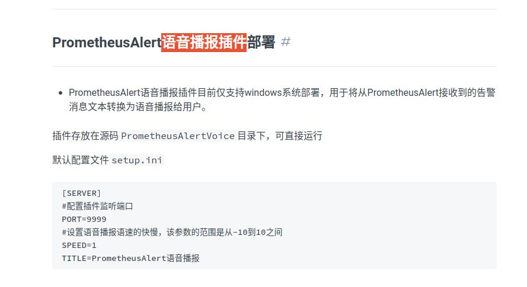
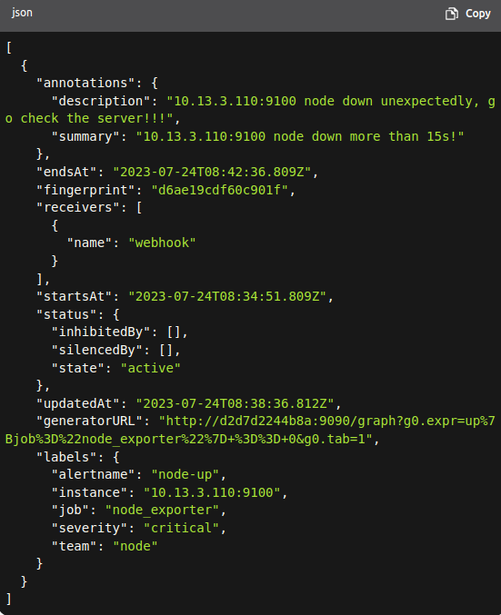

# Alert & TTS

### 1 . poe suggest:
--------------------------
可以使用下面的做法来把Grafana的告警通知转换成语音然后播放:  
1. 安装并配置Grafana告警插件,这可以使用邮件、Slack等方式发送告警。  
2. 设置一个webhook接收Grafana的告警。这个webhook可以连接到自己实现的服务或公共服务。  
3. 自己实现一个webhook服务,用来接收Grafana的告警。在接收到告警通知后,使用语音合成API转换文本为语音。
4. 调用公共的语音合成API,将告警通知文字转换为语音,然后播放。比如 Google Text-to-Speech API、Amazon Polly API等。
5. 将生成的语音文件保存在临时文件夹中,通过 connected voice playing device 播放该语音文件。
6. 你还可以使用语音助手技术,比如Alexa Skills或Google Assistant Actions,接收Grafana的告警,然后通过连接的语音播放设备说出告警内容。
主要关键是:
- 配置好Grafana告警插件和webhook
- 实现接收webhook的服务,调用语音合成API或者语音助手
- 通过连接的语音播放设备播放生成的语音文件
语音通知告警可以更快速有效地引起关注,提高你对重要监控指标的响应时间。
---------------

### 2 . 介绍链接
------------------
[Grafana 警报使用 AWS Polly 进行语音](https://crashlaker.medium.com/grafana-alerting-sound-polyglot-voice-with-aws-polly-f9d1887246a0)

prometheus alert 语音播报

-------------------------------
### 3 . 实践方案与测试过程配置文件

3.1   prometheus
```
global:
  scrape_interval: 15s 
  evaluation_interval: 15s 

alerting:  # 连接alertmanager
  alertmanagers:
    - static_configs:
        - targets: ["10.13.3.109:9093"]

rule_files:
  - "/etc/prometheus/rules.yml"  # 容器内绝对路径

# A scrape configuration containing exactly one endpoint to scrape:
# Here it's Prometheus itself.
scrape_configs:
 scraped from this config.
  - job_name: "prometheus"
    static_configs:
      - targets: ["localhost:9090"]
        #  labels:
        #  instance: prometheus
  - job_name: "node_exporter"
    static_configs:
      - targets: ["10.13.3.109:9100"]
        # labels:
        # instance: 10.13.3.109
      - targets: ["10.13.3.110:9100"]
        # labels: 
        # instance: 10.13.3.110
```

3.2   alertmanager
```
global:
  resolve_timeout: 5m

route: # 告警路由配置，定义如何处理和发送告警
  receiver: webhook
  group_wait: 30s
  group_interval: 1m
  repeat_interval: 4h
  group_by: [alertname]
  routes:
  - receiver: webhook
    group_wait: 10s

receivers: # 告警接收者配置，定义如何处理和发送告警
- name: webhook
  webhook_configs:
  - url: http://10.13.3.109:8060/dingtalk/webhook1/send   #钉url是 IP:/固定路径
    send_resolved: true # 是否发送已解决的告警。如果设置为 true，则在告警解决时发送通知
```

3.3  dingtalk config
```
targets:
  webhook1:
    url: https://oapi.dingtalk.com/robot/send?access_token=4e0772881cda6bc27e793cb9c17550f4496deb99c86786c951bc70a741324138
```

3.4 alert rules 
```
groups:
- name: node-exporter
  rules:
  - alert: node-up
    expr: up{job="node_exporter"} == 0
    for: 15s
    labels:
      severity: critical
      team: node
    annotations:
      summary: "{{ $labels.instance }} node down more than 15s！"
      description: "{{ $labels.instance }} node down unexpectly, go check the server ！！！"

  - alert: CPU Utilization
    expr: 100 - (avg by (instance)(irate(node_cpu_seconds_total{mode="idle"}[1m]) )) * 100 > 80
    for: 30s
    labels:
      user: prometheus
      severity: warning
      team: node
    annotations:
      description: "{{$labels.instance}} CPU Utilization larger than 80%！(current value: {{ $value }}%)"

  - alert: Memutilization
    expr: (node_memory_MemTotal_bytes - (node_memory_MemFree_bytes+node_memory_Buffers_bytes+node_memory_Cached_bytes )) / node_memory_MemTotal_bytes * 100 > 80
    for: 1m
    labels:
      user: prometheus
      severity: warning
      team: node
    annotations:
      description: "{{$labels.instance}} Mem Utilization larger than 80%！(current value: {{ $value }}%)"
```

```
加入kube-state-metrics
存在执行失败的Job: kube_job_status_failed{job="kubernetes-service-endpoints",k8s_app="kube-state-metrics"}==1
集群节点状态错误: kube_node_status_condition{condition="Ready",status!="true"}==1
集群节点内存或磁盘资源短缺: kube_node_status_condition{condition=~"OutOfDisk|MemoryPressure|DiskPressure",status!="false"}==1
集群中存在非Bound状态的PVC： kube_persistentvolumeclaim_status_phase{phase=~"Lost|Pending"}==1
集群中存在启动失败的Pod：kube_pod_status_phase{phase=~"Failed|Unknown"}==1
最近30分钟内有Pod容器重启: changes(kube_pod_container_status_restarts[30m])>0
```
[自定义告警](https://github.com/tian197/project/blob/master/Kubernetes/promethues/prometheus%E5%91%8A%E8%AD%A6%E8%A7%84%E5%88%99.md)
[prometheus alerts](https://samber.github.io/awesome-prometheus-alerts/)


查看请求(目前活跃的告警)
curl http://10.13.3.109:9093/api/v2/alerts?alert.state=active
```


### 4 . homeassistant 

4.1  安装homeassistant
```
docker run -itd --name hoss --privileged --restart=unless-stopped 
-v ./config/:/config -p 8123:8123  ghcr.io/home-assistant/home-assistant
```

4.2 安装hacs, 进入容器并执行命令下载脚本,然后restart容器
```
wget -O - https://get.hacs.xyz | bash -
```

4.3 [配置hacs](https://hacs.xyz/docs/configuration/basic)
	需要清除浏览器缓存
	认证,详见链接中的图片和指引

4.4 容器配置文件集成[hass-xiaomi-miot](https://github.com/al-one/hass-xiaomi-miot),修改配置文件之后重启容器
```
shell_command:
  update_xiaomi_miot: |-
    wget -q -O - https://ghproxy.com/raw.githubusercontent.com/al-one/hass-xiaomi-miot/master/install.sh | HUB_DOMAIN=ghproxy.com/github.com ARCHIVE_TAG=latest bash -
```

4.5 Xiaomi Miot Auto: intelligent_speaker
	开发者工具中调用服务,执行tts 播放或者执行命令

4.6 动态自动化post text to service
```
- id: '1690281875853'
  alias: 新建自动化
  description: ''
  trigger:
  - platform: webhook
    allowed_methods:
    - POST
    - PUT
    local_only: true
    webhook_id: -zCkMdYsuwdFc4f3uiuijv9ip
    id: '01'
  condition: []
  action:
  - service: xiaomi_miot.intelligent_speaker
    data:
      entity_id: media_player.xiaomi_lx01_8682_play_control
      text: "{{ trigger.json.commonAnnotaions.description }}"
  mode: single
```

note: webhook使用的借鉴
```
https://github.com/al-one/hass-xiaomi-miot/issues/907
```

### 5. alertmanager 配置

5.1  webhook 和 dingding  webhook 配置相同

5.2 POST 结构参考
```
{
  "version": "4",
  "groupKey": "{}/{severity=~\"^critical$\"}:{alertname=\"node-up\"}",
  "status": "firing",
  "receiver": "default",
  "groupLabels": {
    "alertname": "node-up"
  },
  "commonLabels": {
    "alertname": "node-up",
    "instance": "example.com:9100",
    "job": "node_exporter",
    "severity": "critical",
    "team": "node"
  },
  "commonAnnotations": {
    "description": "{{ $labels.instance }} node down unexpectly, go check the server ！！！",
    "summary": "{{ $labels.instance }} node down more than 15s！"
  },
  "externalURL": "http://example.com:9093",
  "alerts": [
    {
      "status": "firing",
      "labels": {
        "alertname": "node-up",
        "instance": "example.com:9100",
        "job": "node_exporter",
        "severity": "critical",
        "team": "node"
      },
      "annotations": {
        "description": "{{ $labels.instance }} node down unexpectly, go check the server ！！！",
        "summary": "{{ $labels.instance }} node down more than 15s！"
      },
      "startsAt": "2021-08-01T10:00:00.000Z",
      "endsAt": "0001-01-01T00:00:00Z",
      "generatorURL": "http://example.com:9090/graph?g0.expr=up%7Bjob%3D%22node_exporter%22%7D+%3D%3D+0&g0.tab=1"
    }
  ]
}
```