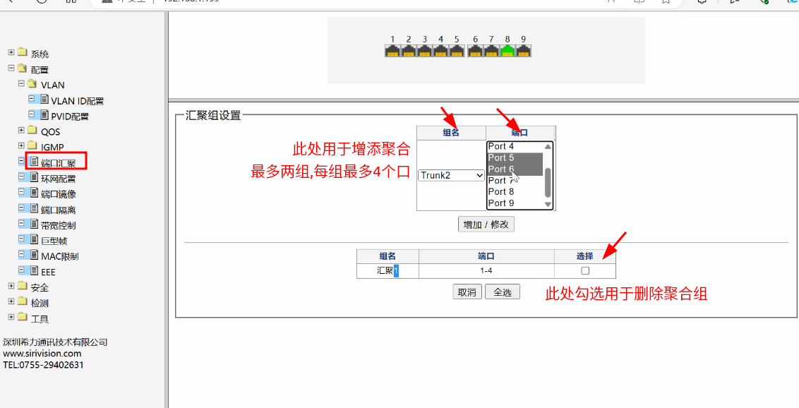
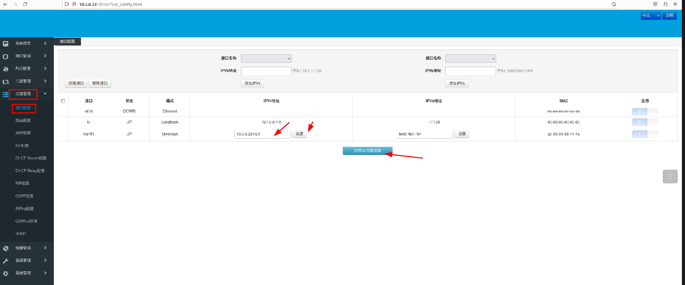
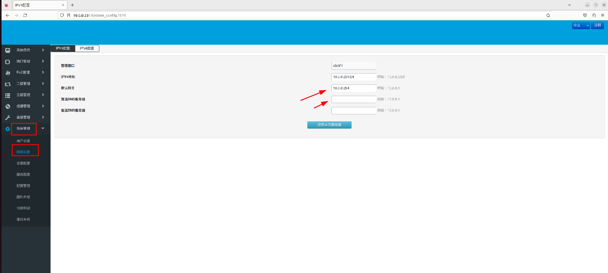
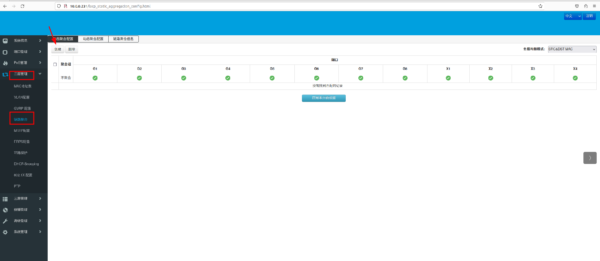
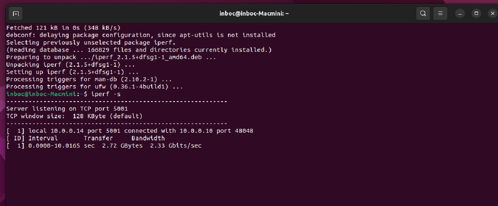

0. 拓扑路径(drow.io绘制)
	nexcloud/inboc-sys-junior/mindmap/lab_topology.drawio
## 1. 希力威视2.5G网管交换机
--------------------------------
1.1 登录web & 修改ip
	连接电脑和交换机,设置电脑和交换机为同网段ip地址
	浏览器访问出厂默认管理ip(192.168.1.199  user:admin  passwd:admin) 
	本例已经修改交换机管理ip分别为(10.0.0.233/24   10.0.0.234/24   网关:10.0.0.254)
	修改后重新登录  
    

1.2 链路聚合
	选择端口汇聚,选择trunk1,鼠标拖动选择目标端口,点击应用即可添加
	点击apply应用,并点击左侧工具栏内保存按钮  
	
 
## 2. ubuntu配置
----------------------
2.1 双网卡聚合配置文件  /etc/netplan/xxxx.yml
```
network:
  version: 2
  ethernets:              # 网卡设备本身的配置
    enp1s0:
      dhcp4: no           # 关闭自动获取ip
      optional: true      # 设备是可选的
    enp7s0:
  bonds:                  # 网卡聚合的配置
    bond0:
      addresses: [10.0.0.30/24]   # 设置bond0 ip
      routes:                     # 设置路由
        - to: default
          via: 10.0.0.1
          metric: 100
      nameservers:                
        addresses: [10.0.0.10]    # 设置dns
      interfaces:                 # 绑定的网卡接口
        - enp1s0
        - enp7s0
      parameters:                 # 聚合模式参数
        mode: balance-rr
        mii-monitor-interval: 100
        lacp-rate: fast
        transmit-bash-policy: layer2 
```

2.2 服务冲突
      关闭NetworkManager,Ubuntu 18.04 及更高版本中，聚合网络配置由 Netplan 管理(systemd-networkd).
	  网卡聚合之后,重启NetworkManager服务也无法在桌面管理ip,wifi功能也受限制,暂时无方案解决
	  配置不生效的情况,日志表明是NetworkManager-dispatcher.service冲突
```
sudo systemctl stop NetworkManager
```

2.3 生效以上配置
```
	sudo netplan apply  
```


2.4 删除 bonding 以及 重新配置生效，用于需要重新修改bond设置
```
sudo modprobe -r bonding
sudo netplan apply
```

2.5 检查网卡状态 以及 ip
```
ip a s                        (bond0 & 物理网卡mac地址一致,说明配置成功)
ip link show                  (查看网卡up / down 状态)(查看 master slave 关系)
cat /proc/net/bonding/bond0   (查看bond0详细内容)
```

## 3. 巢客三层交换机
3.1 登录web & 修改ip
	电脑连接交换机,设置同网段ip地址,web访问(user:admin  passwd:admin) 
	 出厂设置管理ip为192.168.10.12；本例已经修改并设置管理ip分别为10.0.0.230/24 , 10.0.0.231/24 , 10.0.0.232/24 
	 修改后点击本应用本页面设置,并重新登录  
	 

3.2 设置默认网关和DNS,修改后点击本应用本页面设置
	本例网关: 10.0.0.254  DNS: 10.13.1.1 , 10.13.1.2 可以通信WAN网  
	

3.3 链路聚合
	本例链路聚合仅用于连接NAS,设置静态链路聚合,按照拓扑图,仅在10.0.0.230设置
	选择创建,勾选目标端口,创建后应用设置  
	
## 4. 局域网内工具测速
4.1 iperf 网卡测试工具检测结果  


## 5. 接入主网测试
	选择交换机10.0.0.230,利用千兆口连接WAN网,不用另做配置,所有pc均已可通信