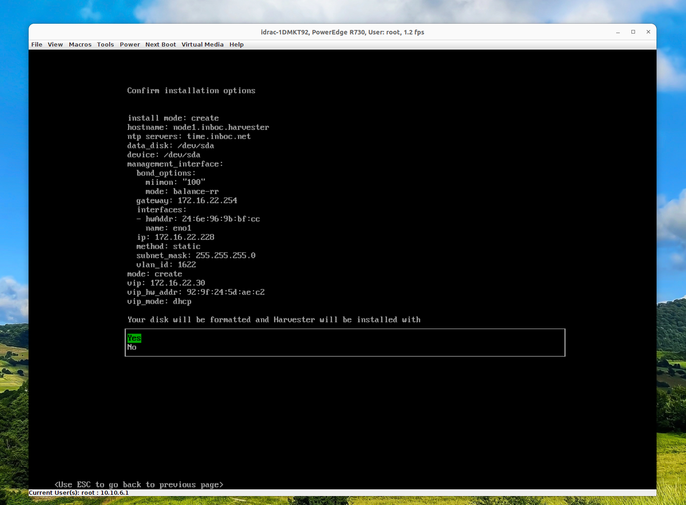
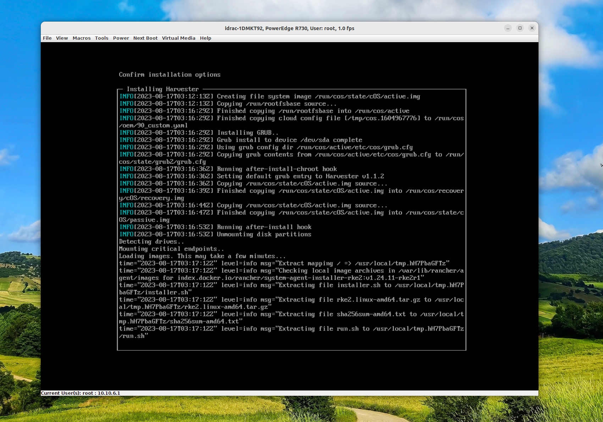
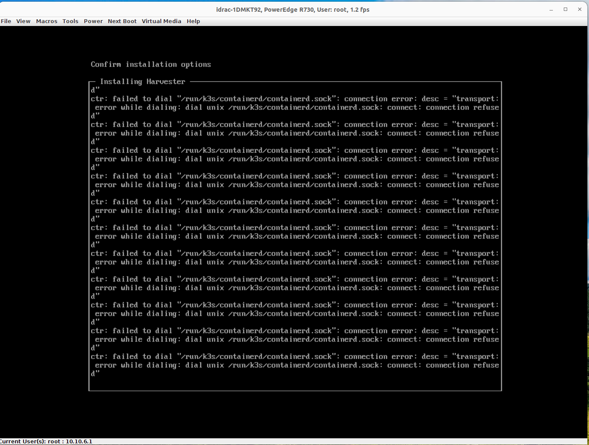
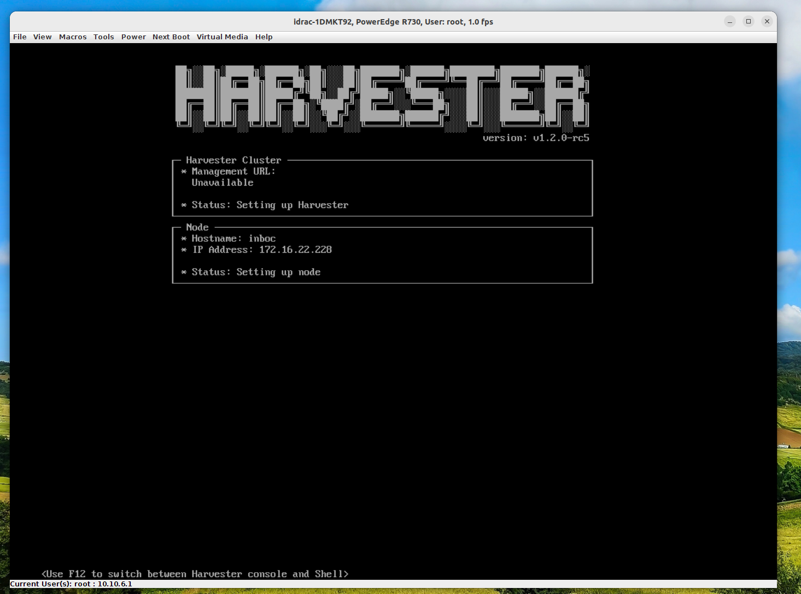

# Harvester

1 .1  iso install 
	map iso device
	select Next Boot on viirtual iso
	restart sys
	some important configuration during installlation
	- nic ip： 172.16.22.228
	- vlan：1622
	- virtual ip：dhcp  or static--172.16.22.50
	- cluster token: harvester-token
	- NTP： time.inboc.net
	- proxy address: 如果需要用 HTTP 代理来访问外部环境，此处输入代理的 URL。否则，留空。
	- HTTP URL： 从远端服务器 URL 导入 SSH 密钥。
	- HTTP URL：如果你需要使用 [Harvester 配置文件](https://docs.harvesterhci.io/zh/v1.1/install/harvester-configuration)来自定义主机，在此处输入 HTTP URL
    

1.2 OS 安装问题
 - 安装时间长（第一次是dhcp配置vip，第二次是vip static 172.16.22.50，或许影响run.sh执行）  
     

- fialed to dial /run/k3s/containerd/containerd.sock (may caused by hostname)  
      

1.3 install pre-version: 1.2
	- vip unavaliable（dhcp & static）& setting up status  
	 
	Note：  发现可以访问node ip 进入Web UI

2 . 平台使用  

2.1 网络  
	- 1. 只利用mgmt，内置的集群管理网络，此时的vm将使用dhcp获取基于nodeip的子网ip，可以通外网，但不在公司内网  
	- 2. 创建集群网络并使用L2VlanNetwork，这将根据vlanid设置同与交换机规划的网络。  
		- 网络-->集群网络配置-->创建集群网络-->命名并标识-->对该集群网络创建网络配置-->选择网卡和bond模式  
		- 基于以上，选择网络--> 虚拟机网络-->类型：L2VlanNetwork(若选择untagged，将不能联通网络)-->vlanID-->集群网络  
		- 创建虚拟机时，使用这个虚拟机网络，配置ip相关内容即可通网。  
		- [流程](https://app.tango.us/app/workflow/Harvester-NetWork-5d7271ea5ed24935a0612bccd0eba2bb)  
		- pdf: nextcloud/inboc-sys-junior/reference  

2.2 虚拟机创建  
	2.2.1 首先上传镜像  
	2.2.2 创建虚拟机  
		配置卷时，分为镜像卷和存储卷  
		当镜像为iso文件，创建一块存储卷（类型：disk，Bus：VirtIO）;一块镜像卷（设置类型cd-rom，Bus：SATA，安装成功后可以弹出）  
		当镜像为img文件，创建一块卷即可，类型：disk，Bus：VirtIO  

2.3 存储  
	longhorn only  