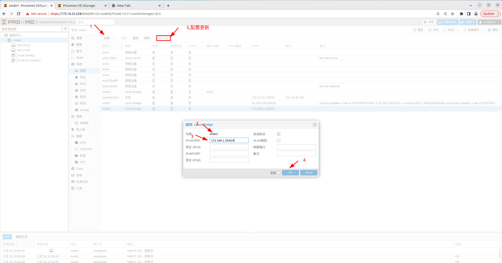

# Proxmox
[参考1](https://foxi.buduanwang.vip/pve/)  
[中文手册](https://pve-doc-cn.readthedocs.io/zh_CN/latest/index.html)  

1 . server：  
         Dell PowerEdge  R730  
         2 x Interl(R) Xeon(R) CPU E5-2696 v4 @ 2.20Ghz  
         416GiB Memory  
2 .  [proxmox镜像](https://www.proxmox.com/en/downloads/proxmox-virtual-environment/iso)  
3 .  web 登录并配置os  
    javaws viewer.jnlp 进入服务器  
    将镜像挂载到虚拟介质（virtual Media  选择镜像路径并映射）  
    Next Boot（设置 virtual cd boot）  
    Power  设置 restart ，按F2进入设置bios  
    正常安装（没有对本服务器做raid设置）  
    安装过程的ip设置  
    ip： 172.16.22.228， vlan：1622， dns：10.13.1.1，login： root Inboc@2020  
    email: chao.long@inboc.net  
	
4 . web 前端登录  
    172.16.22.228:8006 无法联通，且不能ping任何地址  
    ip a s 只有vmbr0  
    修改并重新设置 /etc/network/interfaces  
```
auto lo  
iface lo inet loopback  

auto eno1.1622                #设置服务器在交换机的vlan
iface eno1.1622 inet static
      address  172.16.22.228/24
      gateway  172.16.22.254
      post-up echo 1 > /proc/sys/net/ipv4/ip_forward
      post-up echo 1 > /proc/sys/net/ipv4/conf/eno1/proxy_arp

auto vmbr0
iface vmbr0 inet static
        address 172.16.22.50/24
        gateway 172.16.22.254
        bridge-ports none    #桥接的网卡
        bridge-stp off
        bridge-fd 0         #延迟传输的s

iface eno2 inet manual
iface eno3 inet manual
iface eno4 inet manual
iface enp130s0f0 inet manual
iface enp130s0f1 inet manual
```
上述配置之后，可以ping  可以ssh，不能登录web ui

5 . 解决web ui登录
   实际原因：
        系统安装成功，但是pve安装不完整
        网卡使用虚拟网卡做连接，并桥接到某物理网卡，同时划分到交换机的vlan中。
        [参考文件](https://foxi.buduanwang.vip/virtualization/pve/681.html/)
```
/etc/network/interfaces
auto lo
iface lo inet loopback
iface eno1 inet manual
iface eno1.1622 inet manual
auto vmbr0
iface vmbr0 inet manual
        bridge-ports eno1
        bridge-stp off
        bridge-fd 0

auto vmbr0v1622
iface vmbr0v1622 inet static
        address 172.16.22.228
        netmask 255.255.255.0
        gateway 172.16.22.254
        bridge-ports eno1.1622

iface eno2 inet manual
iface eno3 inet manual
iface eno4 inet manual
iface enp130s0f0 inet manual
iface enp130s0f1 inet manual
```

6 .  设置虚拟机子网，基于网络配置以上内容继续添加
6.1 宿主机添加子网
```
auto vmbr1
iface vmbr1 inet static
    address 10.0.0.254
    netmask 255.255.255.0
    bridge_ports none
    bridge_stp off
    bridge_fd 0
    post-up echo 1 > /proc/sys/net/ipv4/ip_forward
    post-up iptables -t nat -A POSTROUTING -s '10.100.100.0/24' -o vmbr0.1622 -j MASQUERADE
    post-down iptables -t nat -D POSTROUTING -s '10.100.100.0/24' -o vmbr0.1622 -j MASQUERADE
```
6.1.1 在UI界面实现，新建linux bridge   
	

6 .2 虚拟机设置
 在UI 将目标虚拟机选择网络，加入该子网段，并设置网络
 ```
 ip a a 10.100.100.2/24 dev ens18
 ip route add default via 10.100.100.254
 /etc/resolv.conf
	nameserver 10.13.1.1
```

6.3 不同子网互通
	或许应该是先创建vlan，然后使用其中的虚拟网络